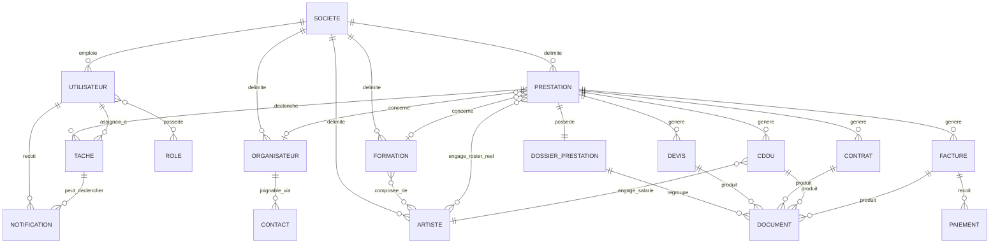
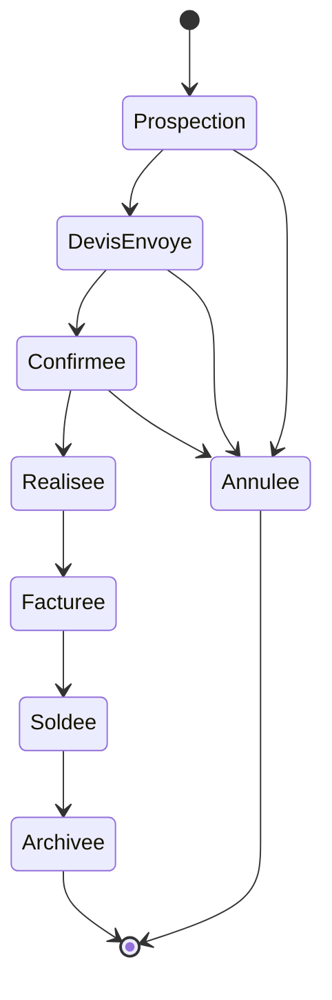
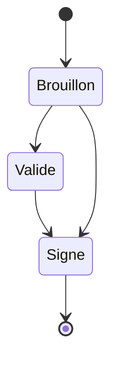
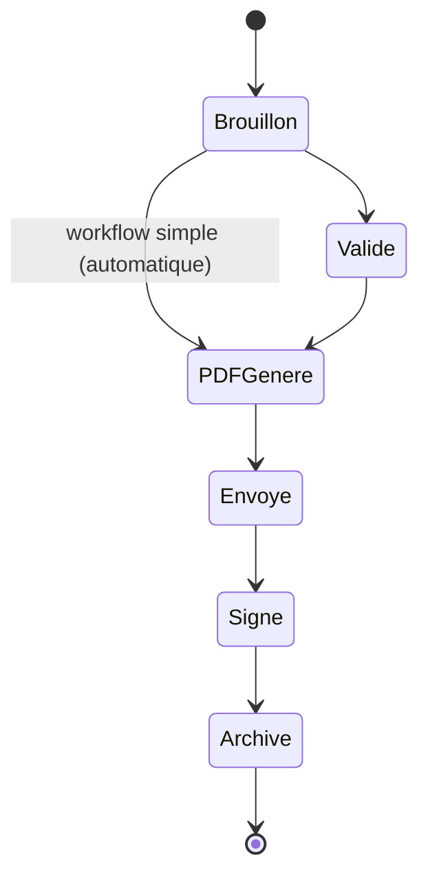
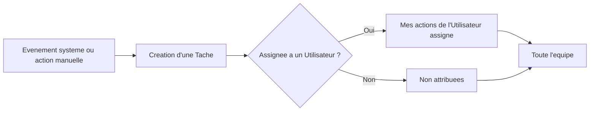

# Domain Model — YGNT Manager Web

Software Design Specification — Document de cadrage n°3
Statut : **Brouillon Sprint 0 — en attente de validation**
Périmètre : modèle métier uniquement. Aucune décision de base de données, de
persistance, d'API, ni de technologie (React, FastAPI ou autre) n'est prise
dans ce document.

Base normative : `00_PRODUCT_VISION.md` et `01_PRODUCT_PRINCIPLES.md`. Les
brouillons de travail (`drafts/PROJECT_CHARTER.md`, `drafts/WORKFLOWS.md`) et
les documents du Desktop (`docs/BUSINESS_RULES.md`,
`docs/PRESTATIONS_ARCHITECTURE.md`, `docs/CDDU_ARCHITECTURE.md`, à la racine
du dépôt) n'ont valeur que de **référence métier existante** — repris
uniquement lorsqu'ils sont explicitement cités, jamais comme source de
décision.

**Discipline de rédaction** : aucune règle métier n'est inventée. Là où une
information manque, ce document le signale explicitement au fil du texte et
consolide le point en [§9. Décisions à arbitrer](#9-décisions-à-arbitrer)
plutôt que de trancher.

---

## Table des matières

1. [Objet et périmètre du document](#1-objet-et-périmètre-du-document)
2. [Vue d'ensemble du modèle](#2-vue-densemble-du-modèle)
3. [Entités métier](#3-entités-métier)
4. [Relations entre entités](#4-relations-entre-entités)
5. [Règles métier importantes](#5-règles-métier-importantes)
6. [Diagrammes](#6-diagrammes)
7. [Cas particuliers](#7-cas-particuliers)
8. [Cas limites](#8-cas-limites)
9. [Décisions à arbitrer](#9-décisions-à-arbitrer)
10. [Checklist de validation](#10-checklist-de-validation)

---

## 1. Objet et périmètre du document

Ce document décrit **le métier**, indépendamment de toute implémentation :
quelles entités existent, ce qu'elles représentent, comment elles évoluent
dans le temps, et comment elles se relient entre elles.

Il répond à la décision structurante déjà validée
(`00_PRODUCT_VISION.md` §5) : le produit est conçu comme un **SaaS
multi-tenant** dès la conception, même si la V1 n'est exploitée que par un
seul tenant. Ce modèle intègre donc, dès ce document, les entités
Société (Tenant), Utilisateur et Rôle — ce ne sont pas des ajouts futurs.

Il **ne couvre pas** :
- le schéma de base de données (`05_DATABASE.md`) ;
- les contrats d'API (`07_API.md`) ;
- l'architecture technique, l'authentification, le stockage
  (`06_ARCHITECTURE.md`) ;
- les parcours utilisateur détaillés, écran par écran (`04_USE_CASES.md`).

---

## 2. Vue d'ensemble du modèle

Le modèle s'organise en quatre familles d'entités :

| Famille | Entités | Rôle |
|---|---|---|
| **Plateforme** | Société (Tenant), Utilisateur, Rôle | Portent l'isolation multi-tenant et les accès |
| **Répertoire** | Organisateur, Contact, Artiste, Formation | Les personnes et structures avec qui le producteur travaille |
| **Cœur métier** | Prestation, Dossier de prestation | L'événement réel et sa vue consolidée — l'entité centrale (`00_PRODUCT_VISION.md` §4.1) |
| **Documents transactionnels** | Devis, Contrat, CDDU, Facture, Paiement, Document | Ce qui engage juridiquement ou financièrement une Prestation |
| **Pilotage** | Tâche, Notification | Ce qui fait vivre le Cockpit orienté actions (`00_PRODUCT_VISION.md` §7) |

Principe directeur hérité de la Vision et des Principles : **la Prestation
reste le pivot.** Chaque document transactionnel se rattache à une
Prestation ; aucune donnée métier significative n'existe en silo.

---

## 3. Entités métier

### 3.1 Société (Tenant)

**Définition** — L'espace de travail isolé d'un producteur de spectacles sur
la plateforme. Toute donnée métier (Organisateurs, Artistes, Prestations,
documents...) appartient à exactement une Société.

**Rôle métier** — Unité d'isolation des données et de rattachement de tous
les Utilisateurs. C'est la traduction directe, au niveau du modèle métier, de
la décision multi-tenant validée (`00_PRODUCT_VISION.md` §5).

**Responsabilités** — Porter l'identité de la structure de production
(raison sociale, informations légales réutilisées dans les documents
générés) ; regrouper les Utilisateurs qui y travaillent ; délimiter
strictement le périmètre de toutes les autres entités.

**Cycle de vie** — Une Société existe dès qu'un premier Utilisateur y est
rattaché. Les statuts intermédiaires (essai, actif, suspendu...) ne sont pas
définis à ce stade — voir §9.

**Contraintes métier** —
- Aucune donnée d'une Société n'est jamais visible ou modifiable depuis une
  autre Société (invariant de sécurité déjà acté,
  `00_PRODUCT_VISION.md` §11).
- Une Société ne peut pas être vide de tout Utilisateur de façon durable
  (au moins un Utilisateur responsable est nécessaire) — le mécanisme exact
  n'est pas défini, voir §9.

---

### 3.2 Utilisateur

**Définition** — Une personne physique disposant d'un accès à la plateforme,
rattachée à une Société, agissant selon un ou plusieurs Rôles.

**Rôle métier** — Point d'origine de toute action tracée dans le système :
création/modification de Prestations et documents, assignation de Tâches,
destinataire de Notifications.

**Responsabilités** — S'authentifier ; exécuter des actions dans les limites
de son Rôle ; apparaître comme responsable ou collaborateur sur les Tâches et
les Prestations qui lui sont associées.

**Cycle de vie** — Correspond aux deux personas déjà validés
(`00_PRODUCT_VISION.md` §6) : le Producteur/Gérant et le Collaborateur
interne. Les états précis (invité, actif, suspendu, désactivé) et le
processus d'invitation ne sont pas définis à ce stade — voir §9.

**Contraintes métier** —
- Un Utilisateur agit toujours dans le cadre d'une Société.
- Un Utilisateur possède au moins un Rôle.
- La question de savoir si un même Utilisateur peut appartenir à
  **plusieurs** Sociétés (ex. un collaborateur externe intervenant pour
  plusieurs producteurs) n'est pas tranchée — voir §9.

---

### 3.3 Rôle

**Définition** — Un ensemble nommé de permissions déterminant ce qu'un
Utilisateur peut voir et faire au sein d'une Société.

**Rôle métier** — Support du principe de « droits différenciés » déjà validé
pour le persona Collaborateur interne (`00_PRODUCT_VISION.md` §6.2).

**Responsabilités** — Déterminer l'accès aux modules (ex. : accès aux
Prestations mais pas à la Facturation) et le périmètre d'information visible
(ex. : montants masqués pour certains rôles, cas déjà anticipé dans
`00_PRODUCT_VISION.md` §10).

**Cycle de vie** — Non applicable à un Rôle individuellement (c'est une
donnée de configuration plutôt qu'un objet avec un cycle de vie métier).

**Contraintes métier** —
- Un Rôle est toujours scopé à une Société : aucun Rôle n'a de portée
  transversale entre Sociétés.
- La liste exacte des Rôles prédéfinis (au minimum, deux sont pressentis par
  la Vision : « Producteur/Gérant » à droits complets et « Collaborateur »
  à droits restreints) n'est pas figée — voir §9.

---

### 3.4 Organisateur

**Définition** — La structure ou la personne qui engage la Société pour
organiser une Prestation (mairie, comité d'entreprise, salle de concert,
particulier...). Définition reprise telle quelle du Desktop
(`docs/BUSINESS_RULES.md`).

**Rôle métier** — Client contractuel du Devis, du Contrat et de la Facture.

**Responsabilités** — Porter les informations légales et de contact
réutilisées automatiquement dans chaque document généré (forme juridique,
adresse du siège social, SIRET, TVA intracommunautaire, coordonnées
bancaires, représentant).

**Cycle de vie** — Créé → Actif → potentiellement Inactif/Archivé. Jamais
supprimé physiquement s'il est rattaché à un document déjà généré (règle
reprise du Desktop : la fiche est une source de pré-remplissage, pas une
dépendance bloquante).

**Contraintes métier** —
- Un nom est obligatoire.
- L'adresse enregistrée sur la fiche Organisateur est le **siège social** :
  elle ne décrit jamais le lieu où se déroule la Prestation (règle Desktop
  reprise explicitement par la décision de réutiliser le modèle Prestation,
  `00_PRODUCT_VISION.md` §4.1).
- Appartient à exactement une Société.

---

### 3.5 Contact

**Définition** — Une personne physique identifiée comme interlocuteur pour un
Organisateur (ex. : régisseur, service culturel, comptabilité). **Cette
entité n'existe pas telle quelle côté Desktop** (qui ne porte qu'un seul
« représentant » directement sur la fiche Organisateur) : c'est une
évolution du modèle métier pour le Web.

**Rôle métier** — Permettre de joindre la bonne personne selon le sujet
(technique, administratif, financier), sans se limiter à un seul
interlocuteur par Organisateur.

**Responsabilités** — Porter nom, fonction, moyens de contact (téléphone,
email) d'une personne rattachée à un Organisateur.

**Cycle de vie** — Créé en même temps que l'Organisateur ou ajouté
ultérieurement ; retiré ou archivé sans jamais casser les documents déjà
générés (même principe que pour l'Organisateur).

**Contraintes métier** — Largement non définies à ce stade. Ce que porte
exactement un Contact (fonction obligatoire ? un seul contact « principal »
parmi plusieurs ?), sa multiplicité par Organisateur, et si le concept
s'étend à d'autres entités (Artiste, Formation) ne sont **pas tranchés** —
voir §9.

---

### 3.6 Artiste

**Définition** — Une personne physique : musicien, interprète, technicien...
Reprend la définition Desktop (`docs/BUSINESS_RULES.md`,
`docs/CDDU_ARCHITECTURE.md`) : identité individuelle, distincte de l'unité
commerciale vendue (voir Formation, §3.7).

**Rôle métier** — Salarié potentiel d'un CDDU (le CDDU_ARCHITECTURE Desktop
est explicite : « le salarié d'un CDDU est une fiche Artiste ») ; membre
d'une ou plusieurs Formations ; participant réel engagé sur une Prestation.

**Responsabilités** — Porter les informations légales, bancaires et RH
nécessaires à la génération d'un CDDU (adresse, SIREN/SIRET si applicable,
IBAN/BIC, numéro de sécurité sociale, lieu de naissance, numéro de congés
spectacle) ainsi qu'un cachet habituel, réutilisé comme valeur par défaut.

**Cycle de vie** — Créé → Actif → Archivé. Jamais supprimé si rattaché à un
document déjà généré (règle Desktop reprise à l'identique : la fiche est une
source de pré-remplissage, pas une dépendance bloquante).

**Contraintes métier** —
- Au moins un nom (légal et/ou de scène) est obligatoire.
- Le cachet renseigné est une valeur par défaut, jamais figée : chaque
  document peut le modifier au cas par cas.
- Appartient à exactement une Société.

---

### 3.7 Formation

**Définition** — L'unité commerciale vendue à un Organisateur pour une
Prestation : un spectacle, qu'il soit porté par un seul Artiste ou par
plusieurs. **Distincte des personnes qui l'exécutent réellement.**

Cette séparation Artiste/Formation clarifie, pour le Web, une ambiguïté
présente côté Desktop : la table `artists` y porte à la fois l'identité
individuelle et le rôle de « Formation vendue » référencée par
`prestations.artist_id` (voir `docs/PRESTATIONS_ARCHITECTURE.md` §11). Le
Web sépare explicitement les deux, à la demande du présent cadrage.

**Rôle métier** — Objet du Devis, du Contrat de cession et de la Facture —
jamais des CDDU, qui portent toujours sur l'Artiste individuel (règle
Desktop intangible, reprise telle quelle : « la Formation vendue ne doit
jamais être confondue avec les personnes qui la jouent »).

**Responsabilités** — Porter le nom du spectacle et un cachet de cession
habituel, distinct du cachet salarié individuel de chaque Artiste engagé en
CDDU.

**Cycle de vie** — Créée → Active → Archivée, même logique que l'Artiste.

**Contraintes métier** — Le lien entre une Formation et le ou les Artistes
qui la composent (composition figée ou variable dans le temps, une Formation
peut-elle exister sans aucun Artiste rattaché, un même Artiste peut-il
appartenir à plusieurs Formations) **n'est pas tranché**. Le brouillon de
travail non validé (`drafts/PROJECT_CHARTER.md`) évoque une composition à un
ou plusieurs Artistes, mais cela ne constitue pas une décision — voir §9.

---

### 3.8 Prestation

**Définition** — Un événement réel et daté (concert, mariage, festival,
soirée privée...), qui existe en tant que fiche à part entière,
indépendamment du nombre de documents administratifs générés autour de lui.
Reprend intégralement la définition validée du Desktop
(`docs/PRESTATIONS_ARCHITECTURE.md`), conformément à la décision
`00_PRODUCT_VISION.md` §4.1.

**Rôle métier** — **L'entité centrale du système** (`00_PRODUCT_VISION.md`
§4.1/§4.2) : Devis, Contrat, CDDU, Facture et Paiement s'y rattachent, plutôt
que d'exister en silos ressaisis.

**Responsabilités** — Porter le lieu de l'événement (nom, adresse, code
postal, ville), **strictement distinct** du siège social de l'Organisateur
(règle Desktop reprise à l'identique) ; centraliser, via son Dossier
(§3.9), tous les documents et échanges qui la concernent ; porter le
roster réel des Artistes engagés sur cet événement précis (qui peut différer
de la composition habituelle de la Formation vendue — cas déjà traité côté
Desktop sous le nom d'« Équipe de prestation »,
`docs/PRESTATIONS_ARCHITECTURE.md` §11).

**Cycle de vie** — Reprend les statuts validés côté Desktop : *Prospection →
Devis envoyé → Confirmée → Réalisée → Facturée → Soldée → Archivée*, avec un
état terminal *Annulée* accessible depuis les statuts non finaux (suppression
logique, jamais physique, dès qu'un Contrat signé ou une Facture existe).
Voir diagramme §6.2.

**Contraintes métier** —
- Une référence unique lisible (reprise du format Desktop `PREST-AAAA-XXXX`
  ou équivalent — le format exact n'est pas une décision métier et sera
  traité dans `05_DATABASE.md`).
- Artiste/Formation et Organisateur ne sont **pas obligatoires à la
  création** : une Prestation existe dès la demande initiale, avant même de
  savoir qui jouera ou pour quel Organisateur (règle Desktop reprise à
  l'identique).
- Aucun montant n'est porté directement par la Prestation : le montant
  affiché est toujours dérivé du Devis/Contrat/Facture le plus pertinent qui
  lui est rattaché — jamais une vérité financière dupliquée.
- Une Prestation = un événement réel, unique et daté ; pas de
  sous-prestations ni d'imbrication (principe de simplicité,
  `01_PRODUCT_PRINCIPLES.md` §3.6).
- Appartient à exactement une Société.

---

### 3.9 Dossier de prestation

**Définition** — La vue consolidée de tout ce qui se rapporte à une
Prestation : les documents transactionnels qui lui sont rattachés (Devis,
Contrats, CDDU, Factures, Paiements) et les pièces jointes libres (photos,
riders, plans de scène, autorisations...). Reprend le concept validé côté
Desktop (`docs/PRESTATIONS_ARCHITECTURE.md` §4).

**Rôle métier** — Éviter la dispersion de l'information : un seul endroit
pour retrouver tout ce qui concerne un événement, documents générés comme
pièces libres.

**Responsabilités** — Ne **jamais** dupliquer les documents transactionnels
(il les regroupe par référence, il ne recopie pas leurs données) ; porter en
propre uniquement les pièces jointes libres, catégorisées (pièce jointe,
photo, rider, plan de scène, autorisation, autre — catégories reprises du
Desktop).

**Cycle de vie** — Existe dès la création de la Prestation (1 Prestation = 1
Dossier, toujours) et évolue avec elle ; n'a pas de statut propre,
son état reflète celui de la Prestation.

**Contraintes métier** —
- Un Dossier de prestation appartient à exactement une Prestation, et
  réciproquement.
- Le suivi chronologique de l'événement (jalons métier : « Devis envoyé »,
  « Contrat signé », « Concert réalisé »...), documenté côté Desktop sous le
  nom de **Timeline**, fait partie du rôle du Dossier. Le statut de cette
  fonctionnalité comme composante du Dossier ou comme entité distincte
  n'est pas tranché pour le Web — voir §9.

---

### 3.10 Devis

**Définition** — Une proposition commerciale adressée à un Organisateur pour
une Prestation, précédant le Contrat.

**Rôle métier** — Première étape formelle d'engagement commercial dans le
cycle de vie d'une Prestation.

**Responsabilités** — Porter un montant, les conditions proposées, et
tracer la réponse de l'Organisateur (acceptation, refus, absence de
réponse).

**Cycle de vie** — Peu documenté côté Desktop, où le Devis reste un « module
futur » non implémenté. Le Dashboard Desktop mentionne déjà l'usage
(« devis à relancer », `docs/IDEAS_V1_1.md`) et la Timeline de référence cite
« Devis créé », « Devis envoyé », « Devis accepté »
(`docs/PRESTATIONS_ARCHITECTURE.md` §5), mais la liste complète et
définitive des statuts, ainsi que la gestion d'une expiration ou d'une
relance automatique, **ne sont pas définies** — voir §9.

**Contraintes métier** —
- Se rattache à une Prestation et à un Organisateur.
- Peut précéder l'existence d'un Contrat, mais un Contrat n'exige pas
  nécessairement un Devis préalable (aucune règle Desktop ne l'impose).

---

### 3.11 Contrat

**Définition** — Le contrat de cession entre la Société (producteur) et
l'Organisateur, portant sur une Formation. Reprend intégralement les règles
métier déjà validées côté Desktop (`docs/BUSINESS_RULES.md`). **Distinct du
CDDU** (§3.12), qui est un contrat de travail, jamais un contrat de cession.

**Rôle métier** — Document juridique central de la relation commerciale avec
l'Organisateur.

**Responsabilités** — Porter un instantané figé des informations
Organisateur et Formation au moment de sa création/modification — un contrat
déjà généré ne change jamais de contenu rétroactivement si la fiche d'origine
est modifiée ensuite ; porter les conditions financières (cachet, acompte,
TVA, mode de paiement, échéance) ; distinguer strictement le lieu de la
Prestation (hérité d'elle) de l'adresse du siège social de l'Organisateur.

**Cycle de vie** — *Brouillon → Validé → Signé*, statut informatif qui ne
bloque aucune action (règle Desktop reprise à l'identique). Voir diagramme
§6.3.

**Contraintes métier** —
- L'Organisateur et le nom du spectacle sont les deux seules informations
  strictement obligatoires ; le reste peut être complété plus tard.
- La duplication d'un Contrat crée un nouveau Brouillon sans document déjà
  généré : elle sert à repartir d'un modèle, jamais à copier un document déjà
  émis.
- Se rattache à une Prestation.

---

### 3.12 CDDU

**Définition** — Contrat à Durée Déterminée d'Usage : le contrat de travail
qui lie la Société à un Artiste individuel pour une ou plusieurs dates
travaillées. Reprend intégralement les règles métier déjà validées côté
Desktop (`docs/CDDU_ARCHITECTURE.md`).

**Rôle métier** — Document RH/légal, totalement indépendant du Contrat de
cession : « aucun lien direct à un Organisateur » (règle Desktop intangible).

**Responsabilités** — Porter un instantané figé des informations Société et
Artiste au moment de la création ; porter une ou plusieurs dates travaillées
avec leur nombre de cachets ; distinguer le **workflow simple** (une date, un
Artiste, un CDDU, en un geste) du **workflow de mensualisation** (plusieurs
dates, potentiellement plusieurs Prestations, un seul CDDU) — cette
distinction est une règle métier déjà validée côté Desktop, pas une
préférence technique.

**Cycle de vie** — *Brouillon → Validé → PDF généré → Envoyé → Signé →
Archivé*. Statut librement modifiable manuellement, sans blocage d'action.
Le passage automatique à *PDF généré* est déclenché dès qu'un export PDF
réussit dans le workflow simple, mais ne fait jamais reculer un statut déjà
plus avancé ; *Validé* reste toujours une décision humaine explicite. Voir
diagramme §6.4.

**Contraintes métier** —
- Le salarié d'un CDDU est toujours une fiche Artiste individuelle — jamais
  une Formation.
- Une date déjà couverte par un CDDU actif (non archivé) pour un Artiste
  donné n'est jamais proposée par défaut pour un nouveau CDDU, afin d'éviter
  la double-contractualisation involontaire d'une même date.
- Se rattache à une ou plusieurs Prestations (via ses dates travaillées).

---

### 3.13 Facture

**Définition** — Le document qui formalise la demande de règlement adressée
à l'Organisateur pour une Prestation.

**Rôle métier** — Déclenche le suivi financier d'une Prestation ; source des
indicateurs « factures en retard » déjà présents sur le Cockpit Desktop
(`docs/IDEAS_V1_1.md`), repris comme référence pour le Cockpit Web
(`00_PRODUCT_VISION.md` §7).

**Responsabilités** — Porter un montant, une échéance de règlement, et
permettre le rapprochement avec le ou les Paiements reçus.

**Cycle de vie** — Peu documenté côté Desktop (module futur, non
implémenté). Les statuts exacts (émise, partiellement payée, soldée, en
retard...) ne sont **pas définis** — voir §9.

**Contraintes métier** —
- Se rattache à une Prestation (et généralement à un Contrat, sans que ce
  lien soit obligatoire selon les règles connues).
- Le solde restant dû est dérivé des Paiements rattachés, jamais stocké
  indépendamment (cohérent avec le principe déjà appliqué à la Prestation :
  pas de vérité financière dupliquée).

---

### 3.14 Paiement

**Définition** — L'enregistrement d'un règlement reçu de l'Organisateur, se
rapportant à une Facture.

**Rôle métier** — Permet le rapprochement financier précis entre ce qui a
été facturé et ce qui a été effectivement réglé
(`docs/PRESTATIONS_ARCHITECTURE.md` §7 : « rattachement à l'événement et
rapprochement précis avec la facture réglée »).

**Responsabilités** — Porter un montant, une date et un mode de règlement.

**Cycle de vie** — Un Paiement, une fois enregistré, n'a pas de cycle de vie
propre documenté (pas de statut évolutif connu) — voir §9.

**Contraintes métier** —
- Se rattache à une Facture et, indirectement, à la Prestation
  correspondante.
- Le mode de paiement précis (Virement, Chèque... — le Desktop connaît déjà
  ces deux modes pour le Contrat) reste à confirmer pour la Facture — voir
  §9.

---

### 3.15 Document

**Définition** — Un fichier généré par le système (Devis, Contrat, CDDU,
Facture au format bureautique/PDF) ou déposé librement par un utilisateur
(photo, rider, plan de scène, autorisation...), rattaché au Dossier d'une
Prestation.

**Rôle métier** — Matérialise, pour l'utilisateur, le contenu réel des
documents transactionnels, et centralise toute pièce annexe utile à
l'événement.

**Responsabilités** — Porter sa catégorie (reprise du Desktop : pièce
jointe, photo, rider, plan de scène, autorisation, autre), son origine
(document généré depuis Devis/Contrat/CDDU/Facture, ou déposé librement).

**Cycle de vie** — Généré ou déposé → consultable/ouvrable → éventuellement
remplacé par une nouvelle génération (le document précédent n'est pas
automatiquement supprimé, règle Desktop reprise pour les documents
transactionnels).

**Contraintes métier** —
- Un Document généré par un document transactionnel n'existe que si ce
  document transactionnel existe ; il n'est jamais une donnée saisie
  indépendamment.
- Se rattache au Dossier d'une Prestation.

---

### 3.16 Tâche

**Définition** — Un élément actionnable, assigné ou non à un Utilisateur,
qui alimente le Cockpit. **Nouveau pour le Web** : formalise ce que le
Dashboard Desktop calcule déjà à la volée (bloc « À traiter »,
`docs/IDEAS_V1_1.md`) sans le représenter comme un objet à part entière.

**Rôle métier** — Support direct du principe « Cockpit orienté Actions »
(`00_PRODUCT_VISION.md` §7, `01_PRODUCT_PRINCIPLES.md` §3.7) : chaque
élément visible sur le Cockpit doit être une Tâche, jamais une simple
statistique.

**Responsabilités** — Porter une nature (générée automatiquement par le
système, ex. « Facture en retard : relancer », ou créée manuellement par un
Utilisateur), un statut (traitée / non traitée), une assignation optionnelle
à un Utilisateur, et généralement un rattachement à une Prestation ou à un
document.

**Cycle de vie** — Créée (auto ou manuelle) → Assignée ou non → Traitée.
Correspond directement aux trois vues déjà validées du Cockpit
(`00_PRODUCT_VISION.md` §7) : « Mes actions », « Toute l'équipe », « Non
attribuées ».

**Contraintes métier** —
- Une Tâche générée automatiquement doit correspondre à une situation
  métier réelle déjà identifiée côté Desktop comme pertinente pour l'action
  (exemples déjà validés dans les faits par le Dashboard Desktop existant :
  facture en retard, devis à relancer, prestation sans facture, CDDU à
  préparer, document non généré). La **liste exhaustive et définitive** des
  types de Tâches automatiques pour le Web n'est pas arrêtée — voir §9.
- Appartient à une Société (jamais visible en dehors de son tenant).

---

### 3.17 Notification

**Définition** — Un message informant un Utilisateur d'un événement le
concernant (ex. : une Tâche lui a été assignée). **Nouveau pour le Web**,
aucun équivalent documenté côté Desktop (application mono-utilisateur, donc
sans besoin de notifier un autre utilisateur).

**Rôle métier** — Porte à la connaissance d'un Utilisateur un événement qu'il
n'aurait pas vu spontanément, notamment dans un contexte multi-utilisateur
(`00_PRODUCT_VISION.md` §5).

**Responsabilités** — Rester non intrusive et alignée sur le principe de
simplicité : ne pas dupliquer inutilement ce que le Cockpit montre déjà.

**Cycle de vie** — Non lue → Lue. Le reste (canaux de diffusion, événements
précis qui déclenchent une Notification, relation exacte avec la Tâche) n'est
**pas défini** — voir §9.

**Contraintes métier** — Aucune contrainte métier ferme ne peut être énoncée
à ce stade au-delà de son rattachement à un Utilisateur — voir §9.

---

## 4. Relations entre entités

| Entité source | Relation | Entité cible | Cardinalité | Fondement |
|---|---|---|---|---|
| Société | emploie | Utilisateur | 1 → 0..N | §5 Vision (multi-tenant) |
| Société | délimite | Organisateur, Artiste, Formation, Prestation | 1 → 0..N | §5 Vision (isolation) |
| Utilisateur | possède | Rôle | N ↔ N | §6.2 Vision |
| Organisateur | est joignable via | Contact | 1 → 0..N | §3.5 (non tranché en détail) |
| Formation | est composée de | Artiste | N ↔ N (non tranché) | §3.7 / §9 |
| Prestation | concerne | Organisateur | 0..1 → 0..1 (optionnel à la création) | `PRESTATIONS_ARCHITECTURE.md` §8 |
| Prestation | concerne | Formation | 0..1 → 0..1 (optionnel à la création) | `PRESTATIONS_ARCHITECTURE.md` §8 |
| Prestation | engage | Artiste (roster réel) | 0..N ↔ 0..N | « Équipe de prestation », Desktop §11 |
| Prestation | possède | Dossier de prestation | 1 ↔ 1 | §3.9 |
| Prestation | génère | Devis, Contrat, CDDU, Facture | 1 → 0..N | Principe « gravite autour de la Prestation » |
| Dossier de prestation | regroupe | Document | 1 → 0..N | §3.9 |
| Devis / Contrat / CDDU / Facture | produit | Document | 1 → 0..N | §3.15 |
| CDDU | engage | Artiste | 0..N → 1 (jamais Formation) | Règle Desktop intangible |
| Facture | reçoit | Paiement | 1 → 0..N | §3.14 |
| Prestation / Document | déclenche | Tâche | 0..1 → 0..N | §3.16 |
| Utilisateur | est assigné à | Tâche | 0..1 → 0..N | §3.16 |
| Utilisateur | reçoit | Notification | 1 → 0..N | §3.17 |
| Tâche | peut déclencher | Notification | 0..1 → 0..N | Relation supposée, non tranchée — voir §9 |

---

## 5. Règles métier importantes

Règles déjà validées (Vision, Principles) ou reprises telles quelles du
Desktop, applicables à l'ensemble du modèle :

1. **Isolation multi-tenant absolue** — aucune donnée, aucune Tâche, aucune
   Notification n'est jamais visible en dehors de la Société à laquelle elle
   appartient (`00_PRODUCT_VISION.md` §5, §11).
2. **La Prestation ne porte jamais de montant en propre** — tout montant
   affiché est dérivé du document transactionnel le plus pertinent qui lui
   est rattaché.
3. **Le lieu de la Prestation est toujours distinct du siège social de
   l'Organisateur** — repris à l'identique du Desktop, sans exception.
4. **Instantané figé** — un Contrat ou un CDDU déjà généré ne change jamais
   de contenu rétroactivement parce que la fiche Organisateur, Formation ou
   Artiste d'origine a été modifiée ensuite.
5. **La Formation vendue n'est jamais confondue avec les personnes qui
   l'exécutent** — le Contrat de cession, le Devis et la Facture portent sur
   la Formation ; le CDDU porte toujours sur un Artiste individuel. Règle
   Desktop intangible, reprise sans modification.
6. **Aucune ressaisie** — toute donnée déjà connue (Organisateur, Artiste,
   Formation, lieu) préremplit automatiquement les documents qui s'y
   rattachent, tout en restant modifiable au cas par cas
   (`01_PRODUCT_PRINCIPLES.md` §3.3).
7. **Suppression logique, jamais physique** dès qu'une entité (Organisateur,
   Artiste, Prestation) est rattachée à un document déjà généré ou signé.
8. **Le Cockpit n'affiche que des Tâches actionnables**, filtrées par défaut
   sur l'utilisateur connecté (`00_PRODUCT_VISION.md` §7).
9. **Une date déjà couverte par un CDDU actif n'est jamais reproposée par
   défaut** pour le même Artiste, afin d'éviter la double
   contractualisation involontaire.

---

## 6. Diagrammes

### 6.1 Vue d'ensemble des relations (modèle métier)

### 6.2 Cycle de vie de la Prestation

> Les statuts sont ceux déjà validés côté Desktop
> (`docs/PRESTATIONS_ARCHITECTURE.md` §6). Les transitions exactes autorisées
> (peut-on sauter directement de Confirmée à Soldée ? un retour arrière
> est-il permis ?) ne sont pas explicitement définies par la source — ce
> diagramme illustre l'enchaînement le plus probable, pas une règle
> figée. Voir §9.

### 6.3 Cycle de vie du Contrat de cession

> Statut informatif : il ne bloque aucune action, quel que soit l'état
> (règle Desktop reprise à l'identique).

### 6.4 Cycle de vie du CDDU

> Le passage automatique à *PDF généré* (workflow simple) ne fait jamais
> reculer un statut déjà plus avancé ; *Validé* reste toujours une décision
> humaine explicite (règle Desktop reprise à l'identique,
> `docs/CDDU_ARCHITECTURE.md` §12).

### 6.5 Flux Cockpit / Tâche

> Reprend directement la décision validée `00_PRODUCT_VISION.md` §7.

**Cycles de vie non diagrammés** — Devis, Facture, Paiement, Notification,
Société et Utilisateur n'ont pas de cycle de vie assez défini pour être
représenté sans inventer de statuts. Voir §9.

---

## 7. Cas particuliers

- **Une Prestation sans Formation ni Organisateur connus** — cas normal en
  phase de prospection, pas une anomalie ; les documents transactionnels
  (Devis, Contrat) restent simplement impossibles à générer tant que ces
  informations manquent.
- **Un Artiste engagé sur une Prestation sans appartenir à la Formation
  habituellement vendue** (remplaçant ponctuel) — déjà anticipé par la
  distinction entre Formation (§3.7) et roster réel engagé sur la Prestation
  (§3.8) ; la Formation facturée à l'Organisateur peut différer de la
  composition réelle sur scène, exactement comme la « Formation vendue »
  Desktop diffère de l'« Équipe de prestation ».
- **Un Collaborateur aux droits restreints assigné à une Tâche portant sur
  une donnée qu'il ne peut pas voir intégralement** (ex. : montant d'une
  Facture en retard) — la Tâche doit rester actionnable sans exposer une
  information hors du périmètre de son Rôle ; le détail de ce qui est masqué
  n'est pas défini — voir §9.
- **Une Société avec un seul Utilisateur** — le modèle doit rester aussi
  simple à utiliser que le Desktop actuel (`00_PRODUCT_VISION.md` §10) :
  les Tâches non assignées et « Mes actions » convergent alors vers la même
  liste.

---

## 8. Cas limites

- **Un Artiste appartient à deux Formations différentes, engagées le même
  jour sur deux Prestations distinctes** — situation possible si la
  cardinalité Formation↔Artiste est confirmée en many-to-many (§9) ; aucune
  règle de blocage n'est connue côté Desktop (pas de contrôle de
  disponibilité), donc aucune n'est présumée ici.
- **Une Prestation est annulée après qu'un Contrat a déjà été signé et
  qu'une Facture a été émise** — cohérent avec la règle de suppression
  logique (§5, règle 7) : le statut passe à Annulée, rien n'est supprimé,
  les documents déjà générés restent consultables.
- **Un CDDU est archivé par erreur alors que la date doit être reprise** —
  déjà traité côté Desktop : une option d'affichage explicite permet de
  faire réapparaître les dates couvertes par un CDDU archivé, sans jamais
  bloquer la création d'un nouveau CDDU sur cette date
  (`docs/CDDU_ARCHITECTURE.md` §7).
- **Une Facture est soldée par un Paiement dont le montant dépasse le
  montant dû** (trop-perçu) — aucune règle connue ne couvre ce cas côté
  Desktop (module non implémenté) — voir §9.
- **Un Utilisateur est retiré d'une Société alors que des Tâches lui sont
  encore assignées** — le devenir de ces Tâches (réassignation automatique
  vers « Non attribuées », blocage, autre) n'est pas défini — voir §9.

---

## 9. Décisions à arbitrer

Points identifiés dans ce document qui ne peuvent pas être tranchés sans
invention de règle métier. Aucun n'a été présumé dans les sections
précédentes au-delà de ce qui est explicitement signalé.

1. **§3.1 Société** — statuts possibles d'une Société (essai, actif,
   suspendu, résilié...) et mécanisme garantissant qu'elle conserve toujours
   au moins un Utilisateur responsable.
2. **§3.2 Utilisateur** — un Utilisateur peut-il appartenir à plusieurs
   Sociétés simultanément (ex. collaborateur externe multi-clients) ? États
   précis du cycle de vie (invité, actif, suspendu, désactivé) et processus
   d'invitation.
3. **§3.3 Rôle** — liste exacte et définitive des Rôles prédéfinis ; les
   Rôles sont-ils figés par le produit ou personnalisables par chaque
   Société ?
4. **§3.5 Contact** — multiplicité exacte par Organisateur, champs
   obligatoires, notion de contact « principal », et si ce concept
   s'applique aussi à l'Artiste ou à la Formation.
5. **§3.7 Formation** — cardinalité exacte de la composition
   Formation↔Artiste (un seul Artiste possible, obligatoirement au moins
   un ?), et si cette composition peut varier dans le temps sans créer une
   nouvelle Formation.
6. **§3.9 Dossier de prestation** — la Timeline (jalons métier
   chronologiques, déjà validée côté Desktop) doit-elle être modélisée comme
   une entité à part entière pour le Web, ou rester une simple
   responsabilité du Dossier comme décrit ici ?
7. **§3.10 Devis** — liste complète et définitive des statuts, gestion d'une
   expiration, et règle de relance automatique (au-delà de la simple
   détection déjà présente côté Desktop).
8. **§3.13 Facture** — liste complète et définitive des statuts, format de
   numérotation, et obligation ou non d'un Contrat préalable.
9. **§3.14 Paiement** — liste des modes de paiement acceptés pour la
   Facture, et traitement d'un trop-perçu (cas limite §8).
10. **§3.16 Tâche** — liste exhaustive et définitive des types de Tâches
    générées automatiquement par le système.
11. **§3.17 Notification** — canaux de diffusion (in-app uniquement, email,
    autre), liste des événements qui déclenchent une Notification, et
    relation exacte avec la Tâche (1:1, 1:N, indépendante).
12. **§7 Cas particuliers** — règle exacte de masquage d'information dans
    une Tâche selon le Rôle du Collaborateur assigné.
13. **§8 Cas limites** — devenir des Tâches d'un Utilisateur retiré d'une
    Société.
14. **§6.2** — transitions exactement autorisées entre les statuts de la
    Prestation (retour en arrière possible ou non, sauts de statuts
    autorisés ou non).

---

## 10. Checklist de validation

- [ ] Les dix-sept entités demandées sont toutes présentes et définies
      (§3).
- [ ] Chaque entité dispose bien de : définition, rôle métier,
      responsabilités, cycle de vie, contraintes métier.
- [ ] Les relations entre entités (§4) sont validées telles quelles ou
      amendées.
- [ ] Les règles métier importantes (§5) sont validées sans réserve.
- [ ] Les diagrammes (§6) sont jugés fidèles aux règles déjà validées.
- [ ] Les cas particuliers (§7) et cas limites (§8) sont jugés complets à ce
      stade.
- [ ] Chacune des 14 décisions listées en §9 a reçu une réponse explicite,
      ou est explicitement reportée à un document ultérieur.
- [ ] Ce document peut servir de référence stable pour rédiger
      `04_USE_CASES.md` et `05_DATABASE.md`.
