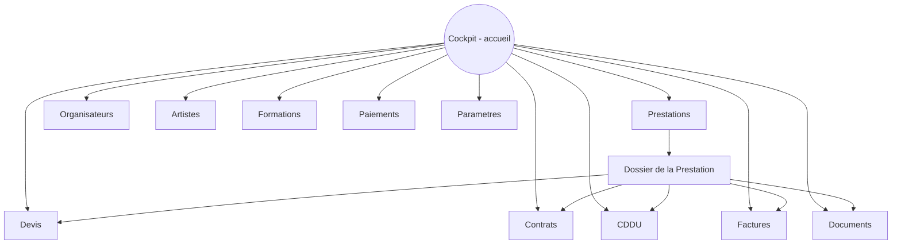
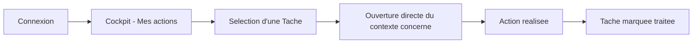
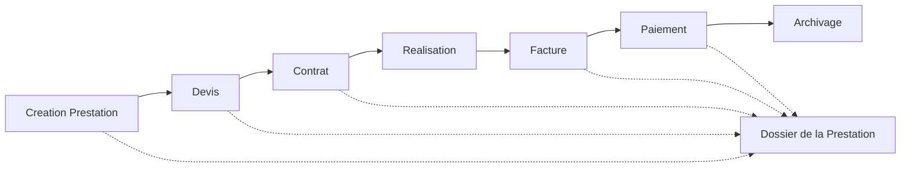
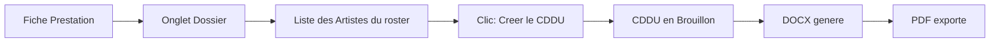
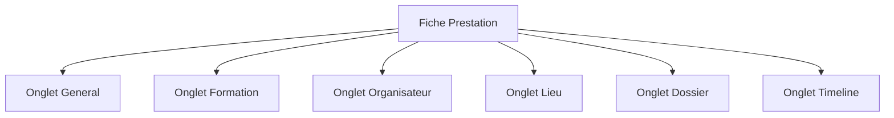

# UX Architecture — YGNT Manager Web

Software Design Specification — Document de cadrage n°4
Statut : **Brouillon Sprint 0 — en attente de validation**
Périmètre : organisation fonctionnelle de l'expérience utilisateur
uniquement. Aucun design graphique, aucune maquette visuelle, aucune
technologie (React, FastAPI ou autre), aucune base de données, aucune API.

Base normative : `00_PRODUCT_VISION.md`, `01_PRODUCT_PRINCIPLES.md`,
`02_DOMAIN_MODEL.md`. Toute organisation décrite ici découle de ces trois
documents ; aucune règle métier n'y est réinventée.

**Discipline de rédaction** : ce document *conçoit* l'architecture
fonctionnelle (c'est l'objet de la mission), mais chaque choix s'appuie sur
un principe ou une règle déjà validés, cité explicitement. Là où plusieurs
options restent réellement ouvertes (aucun document précédent ne permet de
trancher), le choix n'est pas figé : il est consolidé en
[§9. Décisions à arbitrer](#9-décisions-à-arbitrer) plutôt qu'imposé.

---

## Table des matières

1. [Structure générale de l'application](#1-structure-générale-de-lapplication)
2. [Organisation de chaque module](#2-organisation-de-chaque-module)
3. [Parcours utilisateur](#3-parcours-utilisateur)
4. [Recherche globale](#4-recherche-globale)
5. [Filtres](#5-filtres)
6. [Vues](#6-vues)
7. [Principes UX](#7-principes-ux)
8. [Diagrammes](#8-diagrammes)
9. [Décisions à arbitrer](#9-décisions-à-arbitrer)
10. [Checklist de validation](#10-checklist-de-validation)

---

## 1. Structure générale de l'application

L'application s'organise en trois zones fixes et un contenu central, un
schéma standard d'application métier professionnelle — cohérent avec le
principe de simplicité (`01_PRODUCT_PRINCIPLES.md` §3.6) et avec la
présentation homogène déjà en vigueur côté Desktop (`docs/PROJECT.md`,
section Interface).

### 1.1 Menu latéral

Navigation principale entre les modules. Reprend, dans son principe, la
logique déjà connue du Desktop (un module = une entrée de menu,
`docs/PROJECT.md`), étendue aux entités désormais distinctes du Domain
Model :

```
Cockpit
─────────────
Prestations
Organisateurs
Artistes
Formations
─────────────
Contrats
CDDU
Devis
Factures
Paiements
─────────────
Documents
─────────────
Paramètres
```

- Le regroupement en trois blocs (Répertoire / Documents transactionnels /
  Transverse) reprend directement les familles d'entités définies dans
  `02_DOMAIN_MODEL.md` §2 — ce n'est pas un choix graphique arbitraire, c'est
  la structure du modèle métier rendue visible.
- Le Cockpit est isolé en tête de menu : c'est l'écran d'entrée, jamais un
  module parmi d'autres (`00_PRODUCT_VISION.md` §7).
- L'ordre exact des modules, leur libellé précis et la présence
  d'indicateurs numériques (compteurs) sur chaque entrée ne sont pas
  arrêtés — voir §9.
- La visibilité de chaque entrée dépend du Rôle de l'Utilisateur connecté
  (`02_DOMAIN_MODEL.md` §3.3) : un Collaborateur aux droits restreints ne
  voit que les modules auxquels son Rôle donne accès. La règle exacte de
  masquage dépend de la liste définitive des Rôles, non encore arrêtée
  (`02_DOMAIN_MODEL.md` §9 point 3) — voir §9.

### 1.2 Barre supérieure

Zone transverse, toujours visible, indépendante du module consulté :

- **Recherche globale** (§4).
- **Identité de la Société active** — nécessaire dès lors que le produit est
  multi-tenant (`00_PRODUCT_VISION.md` §5), pour que l'Utilisateur sache
  toujours dans quel espace de travail il se trouve.
- **Utilisateur connecté** — accès à son profil, déconnexion.
- **Notifications** — un point d'accès est nécessaire puisque l'entité
  Notification est déjà actée (`02_DOMAIN_MODEL.md` §3.17), mais sa
  présentation exacte (icône avec compteur, panneau déroulant, page dédiée)
  n'est pas arrêtée — voir §9.

### 1.3 Cockpit

Écran d'accueil par défaut à la connexion. Reprend intégralement la
philosophie déjà validée (`00_PRODUCT_VISION.md` §7,
`01_PRODUCT_PRINCIPLES.md` §3.7) : une liste de Tâches actionnables, jamais
un tableau de statistiques.

- Trois vues déjà validées, accessibles par un filtre en tête de Cockpit :
  **« Mes actions »** (par défaut), **« Toute l'équipe »**, **« Non
  attribuées »**.
- Chaque ligne du Cockpit est une Tâche (`02_DOMAIN_MODEL.md` §3.16) :
  cliquer dessus doit amener directement à l'endroit où l'action se
  traite (la Prestation, le document concerné), jamais à un écran
  intermédiaire.
- Regroupement des Tâches par nature ou par urgence à l'écran : non
  arrêté — voir §9.

---

## 2. Organisation de chaque module

Chaque module reprend la présentation homogène déjà en vigueur côté Desktop
(`docs/PROJECT.md`) : recherche locale, vue en liste par défaut, ouverture
d'une fiche détaillée, actions Nouveau/Modifier/Supprimer/Actualiser —
adaptée à la Vue Liste et à la Fiche détaillée décrites en §6. Ce qui suit
détaille, pour chaque module, ce qui lui est propre.

### 2.1 Prestations

- **Vue liste** — reprend les colonnes déjà validées côté Desktop
  (`docs/PRESTATIONS_ARCHITECTURE.md` §9) : Référence, Date, Type
  d'événement, Nom, Formation, Organisateur, Lieu, Statut, Montant (dérivé),
  indicateurs Devis/Contrat/Facture/Paiement.
- **Fiche détaillée** — reprend la structure à onglets déjà validée côté
  Desktop pour la Prestation : Général, Formation, Organisateur, Lieu,
  Dossier, Timeline (`docs/PRESTATIONS_ARCHITECTURE.md` §9). Le Dossier de
  prestation (`02_DOMAIN_MODEL.md` §3.9) y est l'onglet central : il
  regroupe Devis, Contrats, CDDU, Factures, Paiements et pièces jointes
  libres de cette Prestation.
- C'est le seul module où les vues Kanban et Calendrier sont considérées
  pertinentes à ce stade (voir §6.2, §6.3), en cohérence avec son statut
  d'entité centrale (`00_PRODUCT_VISION.md` §4.1).

### 2.2 Organisateurs

- **Vue liste** — nom, forme juridique, ville, nombre de Prestations
  associées.
- **Fiche détaillée** — coordonnées et informations légales
  (`02_DOMAIN_MODEL.md` §3.4), liste des Contacts rattachés (§2.3 ci-dessous
  et `02_DOMAIN_MODEL.md` §3.5), historique des Prestations associées.

### 2.3 Contacts (rattachés à un Organisateur)

- Géré depuis la fiche Organisateur, pas comme module de premier niveau du
  menu latéral (un Contact n'existe pas sans Organisateur,
  `02_DOMAIN_MODEL.md` §3.5).
- Présentation en sous-liste sur la fiche Organisateur : nom, fonction,
  moyen de contact.
- Le détail (contact « principal », multiplicité) dépend d'une décision de
  modèle non tranchée (`02_DOMAIN_MODEL.md` §9 point 4) — voir §9.

### 2.4 Artistes

- **Vue liste** — nom légal / nom de scène, fonction/instrument, ville.
- **Fiche détaillée** — coordonnées, informations légales et bancaires,
  champs RH (nécessaires au CDDU), cachet habituel, historique des
  Prestations et CDDU associés (`02_DOMAIN_MODEL.md` §3.6).

### 2.5 Formations

- **Vue liste** — nom du spectacle, nombre d'Artistes composant la
  Formation, cachet de cession habituel.
- **Fiche détaillée** — composition (liste des Artistes membres) et cachet
  habituel. La gestion précise de la composition (ajout/retrait d'un
  Artiste, historique de composition) dépend d'une décision de modèle non
  tranchée (`02_DOMAIN_MODEL.md` §9 point 5) — voir §9.

### 2.6 Contrats

- **Vue liste** — reprend les colonnes déjà connues côté Desktop : numéro,
  Prestation, Organisateur, Formation, statut, montant.
- **Fiche détaillée** — reprend la structure déjà validée côté Desktop
  (`docs/BUSINESS_RULES.md`) : informations Organisateur/Formation
  pré-remplies (modifiables), conditions financières, actions Générer
  DOCX/PDF, dupliquer.
- Accessible aussi bien depuis le module Contrats que depuis le Dossier
  d'une Prestation (point d'entrée déjà validé côté Desktop,
  `docs/PRESTATIONS_ARCHITECTURE.md` §9).

### 2.7 CDDU

- **Vue liste** — numéro, Artiste (salarié), Prestation de départ, statut.
- **Parcours prioritaire** — reprend exactement le workflow « un clic » déjà
  validé côté Desktop (`docs/CDDU_ARCHITECTURE.md` §6) : depuis la fiche
  Prestation, chaque Artiste du roster porte une action directe « Créer le
  CDDU », sans écran intermédiaire. Détaillé en parcours §3.3.
- **Parcours avancé** — l'assistant de mensualisation, accessible par un
  point d'entrée séparé, jamais mélangé au parcours prioritaire (règle
  Desktop intangible, reprise à l'identique,
  `docs/CDDU_ARCHITECTURE.md` §7).

### 2.8 Devis

- **Vue liste** — Prestation, Organisateur, montant, statut.
- **Fiche détaillée** — conditions proposées, actions Générer, Envoyer,
  Dupliquer en Contrat.
- Le détail exact des statuts affichés dépend d'une décision de modèle non
  tranchée (`02_DOMAIN_MODEL.md` §9 point 7) — voir §9.

### 2.9 Factures

- **Vue liste** — Prestation, Organisateur, montant, solde restant dû
  (dérivé), statut/échéance.
- **Fiche détaillée** — conditions, actions Générer, historique des
  Paiements rattachés (§2.10).
- Le détail exact des statuts affichés dépend d'une décision de modèle non
  tranchée (`02_DOMAIN_MODEL.md` §9 point 8) — voir §9.

### 2.10 Paiements

- Géré principalement depuis la fiche Facture (un Paiement n'a pas de sens
  hors du contexte d'une Facture, `02_DOMAIN_MODEL.md` §3.14), avec une vue
  liste transverse pour un suivi global (date, Facture, Organisateur,
  montant, mode).
- Action principale : enregistrer un règlement reçu, en tête de la fiche
  Facture.

### 2.11 Documents

- Vue transverse de toutes les pièces (générées ou déposées) rattachées à
  un Dossier de prestation (`02_DOMAIN_MODEL.md` §3.15), filtrable par
  catégorie (pièce jointe, photo, rider, plan de scène, autorisation, autre —
  catégories reprises du Desktop, `docs/PRESTATIONS_ARCHITECTURE.md` §4).
- Ce module transverse est un complément de consultation : la gestion
  quotidienne des documents se fait avant tout depuis le Dossier de chaque
  Prestation (§2.1), pour respecter le principe « la Prestation est
  l'entité centrale ».

### 2.12 Paramètres

- Informations de la Société active (raison sociale, coordonnées légales
  réutilisées dans les documents générés).
- Gestion des Utilisateurs et des Rôles de la Société
  (`02_DOMAIN_MODEL.md` §3.2, §3.3).
- Tout le reste (modèles de documents, préférences de notification,
  personnalisation) n'est pas couvert par les documents validés à ce stade
  — voir §9.

---

## 3. Parcours utilisateur

Les parcours ci-dessous sont ceux qui découlent directement de règles déjà
validées. Chacun est repris sous forme de diagramme en §8.

### 3.1 Traiter une Tâche depuis le Cockpit

Le parcours d'entrée par défaut : connexion → Cockpit (« Mes actions ») →
sélection d'une Tâche → action réalisée au plus près du contexte (jamais un
détour par un autre module pour y arriver). Découle directement de
`00_PRODUCT_VISION.md` §7.

### 3.2 Cycle de vie complet d'une Prestation

Prospection → création de la Prestation (Organisateur et Formation
optionnels) → Devis → Contrat → réalisation → Facture → Paiement →
archivage. À chaque étape, le document créé se rattache à la même
Prestation et alimente son Dossier — aucune ressaisie entre les étapes
(`01_PRODUCT_PRINCIPLES.md` §3.3). Découle de `02_DOMAIN_MODEL.md` §3.8 et
de son diagramme de cycle de vie (§6.2 du Domain Model).

### 3.3 Créer un CDDU (parcours prioritaire)

Fiche Prestation → onglet Dossier → liste des Artistes du roster → clic sur
« Créer le CDDU » pour un Artiste → CDDU créé en Brouillon, DOCX généré,
PDF exporté, sans écran intermédiaire. Reprend à l'identique le parcours
déjà validé côté Desktop (`docs/CDDU_ARCHITECTURE.md` §6).

### 3.4 Collaboration à plusieurs sur une même Prestation

Un Collaborateur consulte une Prestation qui lui est assignée ou visible
selon son Rôle ; les Tâches liées à cette Prestation apparaissent dans son
Cockpit si elles lui sont assignées, ou dans « Non attribuées » sinon.
Découle de `00_PRODUCT_VISION.md` §5/§7 et `02_DOMAIN_MODEL.md` §3.16. Le
détail de ce qu'un Collaborateur aux droits restreints voit exactement sur
une Prestation (montants masqués ou non) dépend d'une décision non tranchée
(`02_DOMAIN_MODEL.md` §9 point 12, repris en §9 ci-dessous).

**Parcours non détaillés ici faute de base validée** — l'invitation d'un
nouvel Utilisateur dans une Société, et la création d'un Devis ou d'une
Facture de bout en bout (leurs statuts précis n'étant pas encore arbitrés,
`02_DOMAIN_MODEL.md` §9 points 2, 7, 8) — voir §9.

---

## 4. Recherche globale

**Principe** — Une recherche accessible depuis n'importe quel écran (barre
supérieure, §1.2), qui interroge simultanément les principaux répertoires
(Prestations, Organisateurs, Artistes, Formations) plutôt que d'obliger
l'utilisateur à changer de module pour chercher une information. Découle
directement du principe « aucune ressaisie / organisation »
(`01_PRODUCT_PRINCIPLES.md` §3.2, §3.4) : ne jamais faire naviguer
manuellement quelqu'un qui pourrait trouver l'information en tapant
quelques lettres.

**Comportement attendu** —
- Les résultats sont regroupés par type d'entité (une Prestation, un
  Organisateur, un Artiste...), pas mélangés dans une liste plate.
- Sélectionner un résultat amène directement à sa fiche détaillée (ou, pour
  une Prestation, à son Dossier).

**Non tranché** — le périmètre exact des entités indexées (les documents
transactionnels comme les Contrats ou Factures sont-ils recherchables par
numéro ?), le comportement de recherche approximative (tolérance aux fautes
de frappe), et un éventuel raccourci clavier dédié — voir §9.

---

## 5. Filtres

Chaque module en Vue Liste (§6.1) dispose de filtres cohérents avec les
attributs déjà définis dans `02_DOMAIN_MODEL.md` pour son entité :

| Module | Filtres découlant directement du Domain Model |
|---|---|
| Prestations | Statut (§6.2 du Domain Model), période (date de l'événement), Organisateur, Formation |
| Contrats | Statut (Brouillon/Validé/Signé), Prestation |
| CDDU | Statut (Brouillon → Archivé), Artiste |
| Devis, Factures | Rattachement à une Prestation/Organisateur ; filtre par statut dès que la liste définitive des statuts sera arbitrée (`02_DOMAIN_MODEL.md` §9 points 7, 8) |
| Cockpit (Tâches) | Déjà validé : « Mes actions » / « Toute l'équipe » / « Non attribuées » (`00_PRODUCT_VISION.md` §7) |

Le filtre par période (aujourd'hui / cette semaine / ce mois / personnalisé)
est cohérent avec les usages déjà connus côté Desktop
(`docs/IDEAS_V1_1.md`, idée « Prestations par période ») mais n'est pas une
règle validée pour le Web à ce stade — repris ici comme proposition de
conception, à confirmer (voir §9).

---

## 6. Vues

### 6.1 Vue Liste

Vue par défaut de tous les modules, reprise du standard déjà en vigueur côté
Desktop (`docs/PROJECT.md`) : tableau avec recherche, tri par colonne,
double-clic pour ouvrir la fiche détaillée, actions
Nouveau/Modifier/Supprimer/Actualiser.

### 6.2 Vue Kanban — pertinente pour les Prestations

Le cycle de vie de la Prestation est un enchaînement de statuts déjà validé
(`02_DOMAIN_MODEL.md` §6.2 : Prospection → Devis envoyé → Confirmée →
Réalisée → Facturée → Soldée → Archivée) : une colonne par statut, une carte
par Prestation, est une représentation directe de ce cycle de vie — pas une
fonctionnalité ajoutée arbitrairement. C'est la seule vue Kanban proposée à
ce stade : aucun autre module ne dispose encore d'un cycle de statuts
suffisamment défini pour la justifier (Devis et Facture, notamment, restent
non arbitrés — `02_DOMAIN_MODEL.md` §9 points 7, 8).

### 6.3 Vue Calendrier — pertinente pour les Prestations

Une Prestation est un événement daté (`02_DOMAIN_MODEL.md` §3.8) : une vue
calendrier (mensuelle a minima) est une représentation naturelle de
l'activité à venir, complémentaire au bloc « 5 prochaines prestations » déjà
présent sur le Dashboard Desktop (`docs/IDEAS_V1_1.md`). L'inclusion des
dates de CDDU dans le même calendrier (visualiser aussi les jours de travail
des Artistes) est une extension possible mais non tranchée — voir §9.

### 6.4 Fiches détaillées

Reprennent, pour chaque module, l'organisation en onglets déjà pratiquée
côté Desktop pour la Prestation (§2.1) et le Contrat : une section par
responsabilité de l'entité, telle que décrite dans `02_DOMAIN_MODEL.md` §3.
Une fiche détaillée ne duplique jamais une information qu'elle peut se
contenter d'afficher par référence (principe « aucune donnée en silo »,
`00_PRODUCT_VISION.md` §4.2).

---

## 7. Principes UX

Déclinaison, pour l'expérience utilisateur, des principes déjà validés
(`01_PRODUCT_PRINCIPLES.md` §3).

### 7.1 Simplicité

Reprend le test déjà validé (`01_PRODUCT_PRINCIPLES.md` §3.6) : un nouvel
utilisateur doit comprendre un écran sans explication. Appliqué à l'UX :
pas plus d'un niveau d'imbrication dans les menus, pas d'écran qui ne sert
qu'à confirmer un choix déjà fait ailleurs.

### 7.2 Rapidité

Le Desktop fixe un objectif chiffré pour le Contrat : « moins de deux
minutes » (`docs/PROJECT.md`). Reprendre un objectif équivalent pour les
parcours prioritaires du Web (créer une Prestation, créer un CDDU) est
cohérent avec le principe « chaque fonctionnalité doit faire gagner du
temps » (`01_PRODUCT_PRINCIPLES.md` §3.8), mais aucun chiffre n'est validé
pour le Web à ce stade — voir §9.

### 7.3 Peu de clics

Le parcours CDDU prioritaire (§3.3) est la référence directe : un clic,
aucun écran intermédiaire, pour l'action la plus fréquente
(`docs/CDDU_ARCHITECTURE.md` §6). Ce principe s'applique par extension à
toute action fréquente identifiée dans les futurs parcours : le nombre
d'étapes doit être justifié, jamais accepté par défaut.

### 7.4 Cohérence Desktop/Web

Le vocabulaire, les statuts et les actions (Nouveau/Modifier/Supprimer/
Actualiser, recherche, double-clic pour ouvrir) restent ceux déjà connus par
un utilisateur du Desktop, quand ils s'appliquent sans contradiction avec
les décisions déjà prises pour le Web (multi-tenant, Cockpit, Tâches).
**Cohérence de vocabulaire et de logique, pas de recopie visuelle** : le
Web n'a pas vocation à ressembler pixel pour pixel au Desktop
(`00_PRODUCT_VISION.md` §9, « n'est pas un portage »), mais un producteur
qui connaît déjà le Desktop ne doit jamais être dérouté par un terme ou un
enchaînement différent sans raison.

---

## 8. Diagrammes

### 8.1 Structure de navigation



### 8.2 Parcours — Traiter une Tâche depuis le Cockpit



### 8.3 Parcours — Cycle de vie d'une Prestation



### 8.4 Parcours — Créer un CDDU (workflow prioritaire)



### 8.5 Structure d'une fiche Prestation



---

## 9. Décisions à arbitrer

Points identifiés dans ce document qui relèvent d'un choix UX réel, non
tranché par les documents déjà validés.

1. **§1.1** — Ordre exact et libellés définitifs des entrées du menu
   latéral ; présence ou non de compteurs numériques par module.
2. **§1.1** — Règle exacte de masquage des entrées de menu selon le Rôle
   (dépend de `02_DOMAIN_MODEL.md` §9 point 3).
3. **§1.2** — Présentation de l'accès aux Notifications (icône avec
   compteur, panneau déroulant, page dédiée) et, si un Utilisateur peut
   appartenir à plusieurs Sociétés (`02_DOMAIN_MODEL.md` §9 point 2), la
   présence d'un sélecteur de Société active.
4. **§1.3** — Règle de regroupement des Tâches à l'écran du Cockpit (par
   nature, par urgence, autre).
5. **§2.3** — Multiplicité et détail exact des Contacts par Organisateur
   (`02_DOMAIN_MODEL.md` §9 point 4).
6. **§2.5** — Gestion précise de la composition d'une Formation
   (`02_DOMAIN_MODEL.md` §9 point 5).
7. **§2.8 / §2.9** — Liste définitive des statuts affichés pour Devis et
   Facture (`02_DOMAIN_MODEL.md` §9 points 7, 8).
8. **§2.12** — Périmètre exact du module Paramètres au-delà de la Société
   et des Utilisateurs/Rôles (modèles de documents, préférences de
   notification...).
9. **§3.4** — Détail de ce qu'un Collaborateur aux droits restreints voit
   exactement sur une Prestation qui ne relève pas entièrement de son Rôle.
10. **§3** — Parcours d'invitation d'un nouvel Utilisateur dans une Société
    (dépend de `02_DOMAIN_MODEL.md` §9 point 2).
11. **§4** — Périmètre exact de la recherche globale (documents
    transactionnels inclus ou non), tolérance aux fautes de frappe,
    raccourci clavier dédié.
12. **§5** — Confirmation du filtre par période transversal (aujourd'hui /
    semaine / mois / personnalisé), repris ici comme proposition inspirée
    d'une idée Desktop non encore validée pour le Web.
13. **§6.3** — Inclusion ou non des dates de CDDU dans la vue Calendrier des
    Prestations.
14. **§7.2** — Objectif de rapidité chiffré pour les parcours prioritaires
    du Web (équivalent du « moins de deux minutes » Desktop), à définir ou
    non.

---

## 10. Checklist de validation

- [ ] La structure générale (§1 — menu latéral, barre supérieure, Cockpit)
      est validée telle quelle ou amendée.
- [ ] L'organisation de chacun des onze modules (§2) est jugée complète et
      cohérente avec `02_DOMAIN_MODEL.md`.
- [ ] Les parcours utilisateur décrits (§3) sont validés ; les parcours non
      détaillés faute de base (invitation, Devis/Facture de bout en bout)
      sont notés comme à reprendre après arbitrage du Domain Model.
- [ ] La recherche globale (§4) et les filtres (§5) sont validés dans leur
      principe.
- [ ] Le choix des vues Kanban et Calendrier limitées aux Prestations (§6)
      est validé, ou étendu/réduit.
- [ ] Les principes UX (§7) sont validés sans réserve.
- [ ] Les diagrammes (§8) sont jugés fidèles à l'organisation décrite.
- [ ] Chacune des 14 décisions listées en §9 a reçu une réponse explicite,
      ou est explicitement reportée à un document ultérieur.
- [ ] Ce document peut servir de référence stable pour la suite du
      Sprint 0.
