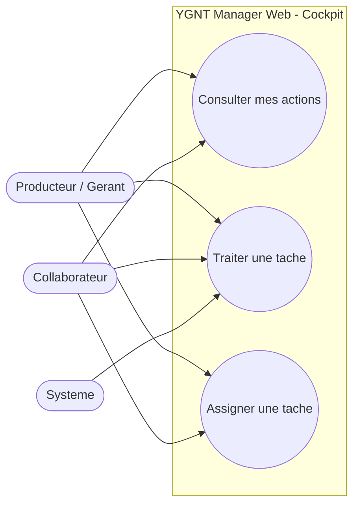
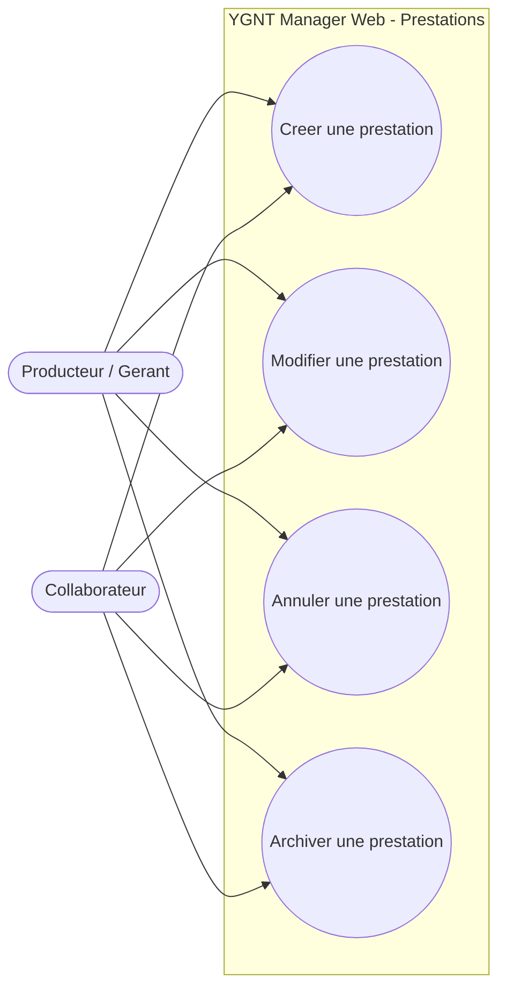
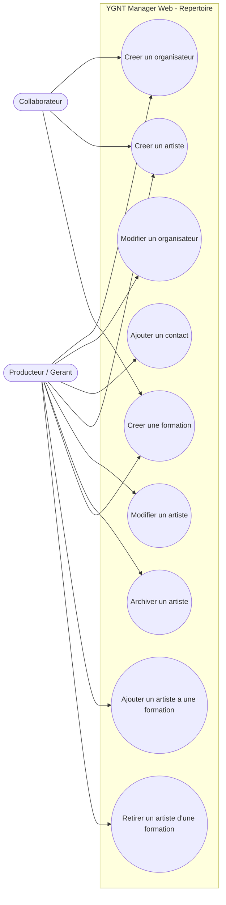
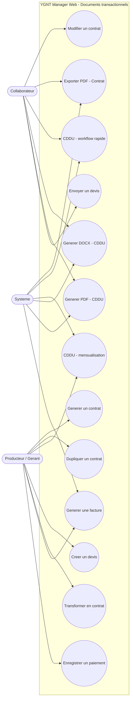
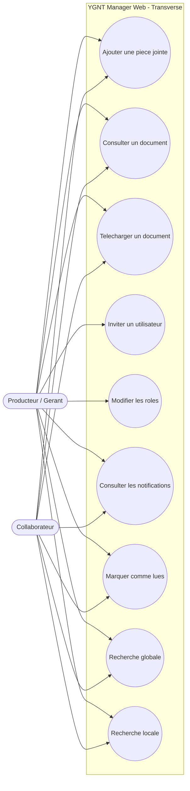

# Use Cases — YGNT Manager Web

Software Design Specification — Document de cadrage n°5
Statut : **Brouillon Sprint 0 — en attente de validation**
Périmètre : interactions entre les utilisateurs (et le système) et le
logiciel uniquement. Aucun code, aucune base de données, aucune API, aucune
technologie (React, FastAPI ou autre).

Base normative : `00_PRODUCT_VISION.md`, `01_PRODUCT_PRINCIPLES.md`,
`02_DOMAIN_MODEL.md`, `03_UX_ARCHITECTURE.md`. Chaque cas d'utilisation
s'appuie sur une règle ou une organisation déjà validée, citée
explicitement.

**Discipline de rédaction** : aucune règle métier n'est inventée. Là où le
Domain Model ou l'UX Architecture ont déjà signalé un point non tranché, le
cas d'utilisation correspondant le rappelle plutôt que de le résoudre
silencieusement ; les nouveaux points identifiés à ce niveau de détail sont
consolidés en [§7. Décisions à arbitrer](#7-décisions-à-arbitrer).

---

## Table des matières

1. [Acteurs](#1-acteurs)
2. [Cas d'utilisation principaux](#2-cas-dutilisation-principaux)
   - [2.1 Cockpit](#21-cockpit)
   - [2.2 Prestations](#22-prestations)
   - [2.3 Organisateurs](#23-organisateurs)
   - [2.4 Artistes](#24-artistes)
   - [2.5 Formations](#25-formations)
   - [2.6 Contrats](#26-contrats)
   - [2.7 CDDU](#27-cddu)
   - [2.8 Devis](#28-devis)
   - [2.9 Factures](#29-factures)
   - [2.10 Documents](#210-documents)
   - [2.11 Utilisateurs](#211-utilisateurs)
   - [2.12 Notifications](#212-notifications)
   - [2.13 Recherche](#213-recherche)
3. [Diagrammes](#3-diagrammes)
4. [Cas particuliers](#4-cas-particuliers)
5. [Cas limites](#5-cas-limites)
6. [Évolutions futures envisageables](#6-évolutions-futures-envisageables)
7. [Décisions à arbitrer](#7-décisions-à-arbitrer)
8. [Checklist de validation](#8-checklist-de-validation)

---

## 1. Acteurs

| Acteur | Nature | Fondement |
|---|---|---|
| **Producteur / Gérant** | Utilisateur humain, persona principal, droits complets sur sa Société | `00_PRODUCT_VISION.md` §6.1 |
| **Collaborateur** | Utilisateur humain, persona secondaire, droits différenciés selon son Rôle | `00_PRODUCT_VISION.md` §6.2, `02_DOMAIN_MODEL.md` §3.3 |
| **Système** | Acteur non humain : déclenche des actions automatiques (génération de documents, création de Tâches, changements de statut dérivés) | `02_DOMAIN_MODEL.md` §3.16 (Tâches automatiques), `docs/CDDU_ARCHITECTURE.md` (génération automatique) |

L'Organisateur et l'Artiste ne sont **pas des acteurs** : ce sont des
entités du domaine, pas des utilisateurs du logiciel
(`00_PRODUCT_VISION.md` §6.3). Ils n'apparaissent dans aucun cas
d'utilisation comme acteur déclencheur.

La distinction précise de ce que peut faire un Collaborateur par rapport au
Producteur/Gérant dépend de la liste définitive des Rôles, non encore
arrêtée (`02_DOMAIN_MODEL.md` §9 point 3). Sauf mention contraire, les cas
d'utilisation ci-dessous s'appliquent aux deux, sous réserve des droits
accordés par le Rôle du Collaborateur.

---

## 2. Cas d'utilisation principaux

### 2.1 Cockpit

#### UC-01 — Consulter mes actions

- **Objectif** : voir immédiatement ce qu'il reste à traiter, sans recherche
  manuelle (`00_PRODUCT_VISION.md` §7).
- **Acteur(s)** : Producteur/Gérant, Collaborateur.
- **Préconditions** : l'utilisateur est connecté.
- **Déclencheur** : connexion, ou clic sur « Cockpit » dans le menu latéral.
- **Scénario nominal** :
  1. Le système affiche le Cockpit avec le filtre « Mes actions » actif par
     défaut.
  2. Le système liste les Tâches assignées à l'utilisateur connecté, non
     traitées.
  3. L'utilisateur peut basculer vers « Toute l'équipe » ou
     « Non attribuées » (`00_PRODUCT_VISION.md` §7).
- **Cas alternatifs** :
  - Aucune Tâche à traiter → le système affiche un état vide, pas une
    erreur.
- **Résultat attendu** : l'utilisateur a une vue complète et priorisée de ce
  qu'il doit traiter.

#### UC-02 — Traiter une tâche

- **Objectif** : réaliser l'action que la Tâche représente, sans détour par
  un autre module (`03_UX_ARCHITECTURE.md` §3.1).
- **Acteur(s)** : Producteur/Gérant, Collaborateur.
- **Préconditions** : une Tâche visible par l'utilisateur existe (UC-01).
- **Déclencheur** : clic sur une Tâche du Cockpit.
- **Scénario nominal** :
  1. Le système ouvre directement le contexte concerné par la Tâche (la
     Prestation ou le document rattaché).
  2. L'utilisateur réalise l'action attendue (ex. : relancer un Devis,
     générer un CDDU).
  3. Le système marque la Tâche comme traitée.
- **Cas alternatifs** :
  - L'utilisateur ouvre la Tâche mais ne réalise pas l'action immédiatement
    → la Tâche reste non traitée, aucune perte de données.
- **Résultat attendu** : la Tâche disparaît de la liste des Tâches à
  traiter.

#### UC-03 — Assigner une tâche

- **Objectif** : orienter une Tâche vers le Collaborateur responsable.
- **Acteur(s)** : Producteur/Gérant, Collaborateur.
- **Préconditions** : une Tâche existe, assignée ou non.
- **Déclencheur** : action « Assigner » depuis une Tâche du Cockpit.
- **Scénario nominal** :
  1. L'utilisateur ouvre une Tâche.
  2. Il sélectionne un Utilisateur de la Société comme responsable.
  3. Le système déplace la Tâche dans « Mes actions » du nouvel assigné.
- **Cas alternatifs** :
  - Retirer une assignation existante → la Tâche repasse dans
    « Non attribuées ».
- **Résultat attendu** : la Tâche apparaît dans le Cockpit filtré de la
  bonne personne.
- **Non tranché** : qui a le droit d'assigner une Tâche à qui (droits
  requis, auto-assignation uniquement ou assignation à un tiers) — voir §7.

---

### 2.2 Prestations

#### UC-04 — Créer une prestation

- **Objectif** : ouvrir une fiche Prestation dès la demande initiale, avant
  même de connaître l'Organisateur ou la Formation
  (`02_DOMAIN_MODEL.md` §3.8).
- **Acteur(s)** : Producteur/Gérant, Collaborateur.
- **Préconditions** : aucune.
- **Déclencheur** : action « Nouveau » depuis le module Prestations.
- **Scénario nominal** :
  1. L'utilisateur saisit a minima le nom et la date de l'événement.
  2. Organisateur et Formation restent optionnels à ce stade.
  3. Le système attribue une référence unique et un statut initial
     « Prospection ».
  4. Le système crée automatiquement le Dossier de la Prestation, vide
     (`02_DOMAIN_MODEL.md` §3.9).
- **Cas alternatifs** :
  - L'Organisateur ou la Formation sont déjà connus → leurs informations
    pré-remplissent immédiatement les champs concernés (aucune ressaisie,
    `01_PRODUCT_PRINCIPLES.md` §3.3).
- **Résultat attendu** : la Prestation est visible dans le module et prête à
  recevoir des documents.

#### UC-05 — Modifier une prestation

- **Objectif** : mettre à jour les informations d'une Prestation existante.
- **Acteur(s)** : Producteur/Gérant, Collaborateur.
- **Préconditions** : la Prestation existe.
- **Déclencheur** : ouverture de la fiche Prestation, modification d'un
  champ.
- **Scénario nominal** :
  1. L'utilisateur modifie un champ (lieu, dates, Organisateur, Formation).
  2. Le système enregistre la modification.
- **Cas alternatifs** :
  - La Prestation a déjà des documents générés (Contrat, CDDU...) → ces
    documents conservent leur instantané figé et ne changent jamais
    rétroactivement (`02_DOMAIN_MODEL.md` §5 règle 4).
- **Résultat attendu** : la fiche reflète les nouvelles informations, sans
  impact sur les documents déjà émis.

#### UC-06 — Annuler une prestation

- **Objectif** : marquer une Prestation comme non réalisée, sans perdre les
  documents déjà générés.
- **Acteur(s)** : Producteur/Gérant, Collaborateur.
- **Préconditions** : la Prestation existe, n'est pas déjà Archivée.
- **Déclencheur** : action « Annuler » depuis la fiche Prestation.
- **Scénario nominal** :
  1. L'utilisateur déclenche l'annulation.
  2. Le système demande confirmation.
  3. Le statut passe à « Annulée » (suppression logique, jamais physique,
     `02_DOMAIN_MODEL.md` §5 règle 7).
- **Cas alternatifs** :
  - La Prestation porte déjà un Contrat signé ou une Facture → l'annulation
    reste possible, les documents restent consultables.
- **Résultat attendu** : la Prestation n'apparaît plus comme active, ses
  documents restent accessibles.
- **Non tranché** : depuis quels statuts l'annulation est autorisée (le
  diagramme de cycle de vie ne couvre explicitement que Prospection, Devis
  envoyé, Confirmée — `02_DOMAIN_MODEL.md` §9 point 14) — voir §7.

#### UC-07 — Archiver une prestation

- **Objectif** : clore définitivement une Prestation soldée.
- **Acteur(s)** : Producteur/Gérant, Collaborateur.
- **Préconditions** : la Prestation est au statut « Soldée » (selon le
  cycle de vie validé, `02_DOMAIN_MODEL.md` §6.2).
- **Déclencheur** : action « Archiver » depuis la fiche Prestation.
- **Scénario nominal** :
  1. L'utilisateur déclenche l'archivage.
  2. Le statut passe à « Archivée » (état terminal).
- **Cas alternatifs** : aucun connu à ce stade.
- **Résultat attendu** : la Prestation reste consultable mais n'apparaît
  plus dans les vues actives par défaut.
- **Non tranché** : un archivage manuel anticipé (avant le statut Soldée)
  est-il permis ? (`02_DOMAIN_MODEL.md` §9 point 14) — voir §7.

---

### 2.3 Organisateurs

#### UC-08 — Créer un organisateur

- **Objectif** : enregistrer une nouvelle structure cliente.
- **Acteur(s)** : Producteur/Gérant, Collaborateur.
- **Préconditions** : aucune.
- **Déclencheur** : action « Nouveau » depuis le module Organisateurs (ou
  depuis la fiche d'une Prestation).
- **Scénario nominal** :
  1. L'utilisateur saisit au moins le nom de l'Organisateur
     (`02_DOMAIN_MODEL.md` §3.4).
  2. Les informations légales et de contact sont optionnelles à la
     création.
  3. Le système enregistre la fiche.
- **Cas alternatifs** : aucun connu à ce stade.
- **Résultat attendu** : l'Organisateur est disponible pour être rattaché à
  une Prestation.

#### UC-09 — Modifier un organisateur

- **Objectif** : mettre à jour les informations d'un Organisateur.
- **Acteur(s)** : Producteur/Gérant, Collaborateur.
- **Préconditions** : l'Organisateur existe.
- **Déclencheur** : ouverture de la fiche, modification d'un champ.
- **Scénario nominal** :
  1. L'utilisateur modifie un champ (adresse du siège social, coordonnées
     bancaires...).
  2. Le système enregistre la modification.
- **Cas alternatifs** :
  - Des documents ont déjà été générés avec les anciennes informations →
    ils gardent leur instantané figé (`02_DOMAIN_MODEL.md` §5 règle 4).
- **Résultat attendu** : la fiche est à jour, les documents déjà émis ne
  sont jamais modifiés rétroactivement.

#### UC-10 — Ajouter un contact

- **Objectif** : rattacher un interlocuteur joignable à un Organisateur
  (`02_DOMAIN_MODEL.md` §3.5).
- **Acteur(s)** : Producteur/Gérant, Collaborateur.
- **Préconditions** : l'Organisateur existe.
- **Déclencheur** : action « Ajouter un contact » depuis la fiche
  Organisateur.
- **Scénario nominal** :
  1. L'utilisateur saisit le nom du Contact.
  2. Il renseigne, si connus, sa fonction et ses moyens de contact.
  3. Le système rattache le Contact à l'Organisateur.
- **Cas alternatifs** : aucun tranché à ce stade.
- **Résultat attendu** : le Contact apparaît dans la liste des interlocuteurs
  de l'Organisateur.
- **Non tranché** : multiplicité exacte, notion de contact « principal »
  (`02_DOMAIN_MODEL.md` §9 point 4) — voir §7.

---

### 2.4 Artistes

#### UC-11 — Créer un artiste

- **Objectif** : enregistrer une nouvelle personne physique (musicien,
  interprète...).
- **Acteur(s)** : Producteur/Gérant, Collaborateur.
- **Préconditions** : aucune.
- **Déclencheur** : action « Nouveau » depuis le module Artistes.
- **Scénario nominal** :
  1. L'utilisateur saisit au moins un nom légal et/ou un nom de scène
     (`02_DOMAIN_MODEL.md` §3.6).
  2. Les informations RH/légales/bancaires et le cachet habituel sont
     optionnels à la création.
  3. Le système enregistre la fiche.
- **Cas alternatifs** : aucun connu à ce stade.
- **Résultat attendu** : l'Artiste est disponible pour être rattaché à une
  Formation ou engagé sur une Prestation.

#### UC-12 — Modifier un artiste

- **Objectif** : mettre à jour les informations d'un Artiste.
- **Acteur(s)** : Producteur/Gérant, Collaborateur.
- **Préconditions** : l'Artiste existe.
- **Déclencheur** : ouverture de la fiche, modification d'un champ.
- **Scénario nominal** :
  1. L'utilisateur modifie un champ (coordonnées, cachet habituel, champs
     RH).
  2. Le système enregistre la modification.
- **Cas alternatifs** :
  - Des CDDU ont déjà été générés → ils gardent leur instantané figé
    (`02_DOMAIN_MODEL.md` §5 règle 4).
- **Résultat attendu** : la fiche est à jour, les CDDU déjà émis ne changent
  jamais rétroactivement.

#### UC-13 — Archiver un artiste

- **Objectif** : retirer un Artiste des propositions actives sans perdre
  l'historique des documents déjà générés.
- **Acteur(s)** : Producteur/Gérant, Collaborateur.
- **Préconditions** : l'Artiste existe.
- **Déclencheur** : action « Archiver » depuis la fiche Artiste.
- **Scénario nominal** :
  1. L'utilisateur déclenche l'archivage.
  2. Le système marque l'Artiste comme archivé (suppression logique, jamais
     physique s'il est rattaché à un document déjà généré,
     `02_DOMAIN_MODEL.md` §5 règle 7).
- **Cas alternatifs** :
  - L'Artiste est membre d'une ou plusieurs Formations actives → voir cas
    limite §5.
- **Résultat attendu** : l'Artiste n'apparaît plus dans les listes de
  sélection actives, son historique reste consultable.

---

### 2.5 Formations

#### UC-14 — Créer une formation

- **Objectif** : enregistrer l'unité commerciale vendue à un Organisateur
  (`02_DOMAIN_MODEL.md` §3.7).
- **Acteur(s)** : Producteur/Gérant, Collaborateur.
- **Préconditions** : aucune.
- **Déclencheur** : action « Nouveau » depuis le module Formations.
- **Scénario nominal** :
  1. L'utilisateur saisit le nom du spectacle.
  2. Le cachet de cession habituel est optionnel à la création.
  3. Le système enregistre la fiche.
- **Cas alternatifs** : aucun connu à ce stade.
- **Résultat attendu** : la Formation est disponible pour être rattachée à
  une Prestation.
- **Non tranché** : une Formation peut-elle être créée sans aucun Artiste
  rattaché ? (`02_DOMAIN_MODEL.md` §9 point 5) — voir §7.

#### UC-15 — Ajouter un artiste (à une formation)

- **Objectif** : composer la Formation avec le ou les Artistes qui la
  jouent.
- **Acteur(s)** : Producteur/Gérant, Collaborateur.
- **Préconditions** : la Formation existe.
- **Déclencheur** : action « Ajouter un artiste » depuis la fiche
  Formation.
- **Scénario nominal** :
  1. L'utilisateur sélectionne un Artiste existant.
  2. Le système l'ajoute à la composition de la Formation.
- **Cas alternatifs** : aucun tranché à ce stade.
- **Résultat attendu** : l'Artiste apparaît dans la composition affichée de
  la Formation.
- **Non tranché** : un même Artiste peut-il appartenir à plusieurs
  Formations ? la composition est-elle figée ou variable dans le temps ?
  (`02_DOMAIN_MODEL.md` §9 point 5) — voir §7.

#### UC-16 — Retirer un artiste (d'une formation)

- **Objectif** : corriger la composition d'une Formation.
- **Acteur(s)** : Producteur/Gérant, Collaborateur.
- **Préconditions** : l'Artiste fait partie de la Formation.
- **Déclencheur** : action « Retirer » depuis la fiche Formation.
- **Scénario nominal** :
  1. L'utilisateur sélectionne l'Artiste à retirer.
  2. Le système le retire de la composition affichée.
- **Cas alternatifs** : aucun tranché à ce stade.
- **Résultat attendu** : la composition de la Formation ne comprend plus cet
  Artiste ; les documents déjà générés ne sont pas affectés (instantané
  figé, `02_DOMAIN_MODEL.md` §5 règle 4).
- **Non tranché** : que se passe-t-il si l'Artiste retiré était le seul
  membre de la Formation ? — voir cas limite §5 et §7.

---

### 2.6 Contrats

#### UC-17 — Générer un contrat

- **Objectif** : produire le contrat de cession entre la Société et
  l'Organisateur.
- **Acteur(s)** : Producteur/Gérant, Collaborateur ; **Système** (génération
  du document).
- **Préconditions** : une Prestation existe.
- **Déclencheur** : action « Générer un contrat » depuis le Dossier d'une
  Prestation, ou « Nouveau » depuis le module Contrats.
- **Scénario nominal** :
  1. L'utilisateur sélectionne l'Organisateur et la Formation, si pas déjà
     connus depuis la Prestation.
  2. Le système pré-remplit les champs disponibles (aucune ressaisie).
  3. L'utilisateur complète les conditions financières si nécessaire.
  4. Le système enregistre le Contrat en statut « Brouillon » avec un
     instantané figé des informations Organisateur/Formation
     (`02_DOMAIN_MODEL.md` §3.11).
- **Cas alternatifs** :
  - Seuls l'Organisateur et le nom du spectacle sont renseignés → le
    Contrat est tout de même créé, le reste reste à compléter
    (`02_DOMAIN_MODEL.md` §3.11).
- **Résultat attendu** : le Contrat apparaît dans le Dossier de la
  Prestation et dans le module Contrats.

#### UC-18 — Modifier un contrat

- **Objectif** : ajuster les informations d'un Contrat existant.
- **Acteur(s)** : Producteur/Gérant, Collaborateur.
- **Préconditions** : le Contrat existe.
- **Déclencheur** : ouverture de la fiche Contrat, modification d'un champ.
- **Scénario nominal** :
  1. L'utilisateur modifie un champ (conditions financières, statut...).
  2. Le système enregistre la modification.
- **Cas alternatifs** :
  - Le statut est modifié librement à tout moment : il est informatif et ne
    bloque aucune action (`02_DOMAIN_MODEL.md` §3.11).
- **Résultat attendu** : le Contrat reflète les nouvelles informations.

#### UC-19 — Dupliquer un contrat

- **Objectif** : repartir d'un Contrat existant comme modèle pour un
  nouveau.
- **Acteur(s)** : Producteur/Gérant, Collaborateur.
- **Préconditions** : le Contrat existe.
- **Déclencheur** : action « Dupliquer » depuis la fiche Contrat.
- **Scénario nominal** :
  1. L'utilisateur déclenche la duplication.
  2. Le système crée un nouveau Contrat en Brouillon, avec un nouveau
     numéro, sans document déjà généré (`02_DOMAIN_MODEL.md` §3.11).
- **Cas alternatifs** : aucun connu à ce stade.
- **Résultat attendu** : un nouveau Contrat modifiable est disponible ; le
  Contrat d'origine n'est pas affecté.

#### UC-20 — Exporter PDF

- **Objectif** : obtenir le Contrat au format PDF pour l'envoyer ou
  l'archiver.
- **Acteur(s)** : Producteur/Gérant, Collaborateur ; **Système** (génération
  du fichier).
- **Préconditions** : le Contrat existe (Brouillon ou plus avancé).
- **Déclencheur** : action « Exporter PDF » depuis la fiche Contrat.
- **Scénario nominal** :
  1. L'utilisateur déclenche l'export.
  2. Le système génère le Document PDF correspondant
     (`02_DOMAIN_MODEL.md` §3.15).
  3. Le Document est rattaché au Dossier de la Prestation.
- **Cas alternatifs** : aucun connu à ce stade (le mécanisme technique de
  génération relève de `06_ARCHITECTURE.md`, hors périmètre ici).
- **Résultat attendu** : un Document PDF est disponible et consultable
  depuis le Dossier.

---

### 2.7 CDDU

#### UC-21 — Workflow rapide (CDDU simple)

- **Objectif** : créer en un geste le contrat de travail d'un Artiste pour
  une date donnée — le cas d'usage prioritaire du module
  (`docs/CDDU_ARCHITECTURE.md` §6).
- **Acteur(s)** : Producteur/Gérant, Collaborateur ; **Système** (création
  automatique et génération).
- **Préconditions** : une Prestation existe, avec au moins un Artiste dans
  son roster (`02_DOMAIN_MODEL.md` §3.8).
- **Déclencheur** : clic sur « Créer le CDDU » en face d'un Artiste, depuis
  le Dossier de la Prestation.
- **Scénario nominal** :
  1. Le système crée le CDDU en statut « Brouillon », numéro attribué.
  2. Le système fige un instantané des informations Société/Artiste.
  3. Le système crée une ligne « date travaillée » correspondant à la date
     de la Prestation.
  4. Le système génère automatiquement le DOCX puis le PDF.
  5. Le statut passe automatiquement à « PDF généré ».
- **Cas alternatifs** :
  - Aucun — c'est le chemin sans question ni écran intermédiaire, par
    définition (`docs/CDDU_ARCHITECTURE.md` §6).
- **Résultat attendu** : un CDDU prêt (DOCX + PDF) existe pour cet Artiste
  et cette date, en un seul geste.

#### UC-22 — Workflow de mensualisation

- **Objectif** : regrouper plusieurs dates travaillées par un même Artiste
  dans un seul CDDU (`docs/CDDU_ARCHITECTURE.md` §7).
- **Acteur(s)** : Producteur/Gérant, Collaborateur ; **Système** (recherche
  des dates, exclusion des dates déjà couvertes).
- **Préconditions** : l'Artiste est engagé sur au moins une Prestation du
  mois concerné.
- **Déclencheur** : action séparée « Créer un CDDU mensualisé », jamais
  mélangée au workflow rapide (règle intangible,
  `docs/CDDU_ARCHITECTURE.md` §7).
- **Scénario nominal** :
  1. L'utilisateur choisit l'Artiste concerné.
  2. Le système recherche toutes les Prestations du mois où cet Artiste est
     engagé.
  3. Le système exclut par défaut les dates déjà couvertes par un CDDU actif
     (non archivé).
  4. L'utilisateur sélectionne les dates à inclure (tout ou partie).
  5. Le système affiche le nombre total de cachets en temps réel.
  6. À la validation, le système crée un seul CDDU avec une ligne par date
     cochée, puis génère DOCX et PDF.
- **Cas alternatifs** :
  - L'utilisateur active l'affichage des dates couvertes par un CDDU
    archivé, pour une reprise exceptionnelle
    (`docs/CDDU_ARCHITECTURE.md` §7).
- **Résultat attendu** : un CDDU unique couvre plusieurs dates travaillées,
  sans double-contractualisation involontaire.

#### UC-23 — Générer DOCX

- **Objectif** : (re)générer le fichier DOCX d'un CDDU, par exemple après
  une modification manuelle.
- **Acteur(s)** : Producteur/Gérant, Collaborateur ; **Système**.
- **Préconditions** : le CDDU existe.
- **Déclencheur** : action « Générer DOCX » depuis la fiche CDDU.
- **Scénario nominal** :
  1. L'utilisateur déclenche la génération.
  2. Le système produit le Document DOCX à partir des informations
     actuelles du CDDU.
- **Cas alternatifs** : aucun connu à ce stade.
- **Résultat attendu** : un Document DOCX à jour est disponible.

#### UC-24 — Générer PDF

- **Objectif** : obtenir le CDDU au format PDF.
- **Acteur(s)** : Producteur/Gérant, Collaborateur ; **Système**.
- **Préconditions** : le CDDU existe (le DOCX n'est pas nécessairement
  préalable dans ce document, le mécanisme technique de conversion relevant
  de `06_ARCHITECTURE.md`).
- **Déclencheur** : action « Générer PDF » depuis la fiche CDDU.
- **Scénario nominal** :
  1. L'utilisateur déclenche l'export.
  2. Le système produit le Document PDF.
- **Cas alternatifs** : aucun connu à ce stade.
- **Résultat attendu** : un Document PDF est disponible et consultable.

---

### 2.8 Devis

#### UC-25 — Créer un devis

- **Objectif** : formaliser une proposition commerciale adressée à un
  Organisateur pour une Prestation (`02_DOMAIN_MODEL.md` §3.10).
- **Acteur(s)** : Producteur/Gérant, Collaborateur.
- **Préconditions** : une Prestation existe.
- **Déclencheur** : action « Nouveau » depuis le module Devis ou depuis le
  Dossier de la Prestation.
- **Scénario nominal** :
  1. L'utilisateur sélectionne l'Organisateur, si pas déjà connu.
  2. L'utilisateur saisit le montant et les conditions proposées.
  3. Le système enregistre le Devis.
- **Cas alternatifs** : aucun connu à ce stade.
- **Résultat attendu** : le Devis apparaît dans le Dossier de la Prestation.
- **Non tranché** : statut initial et liste complète des statuts
  (`02_DOMAIN_MODEL.md` §9 point 7) — voir §7.

#### UC-26 — Envoyer un devis

- **Objectif** : transmettre le Devis à l'Organisateur.
- **Acteur(s)** : Producteur/Gérant, Collaborateur.
- **Préconditions** : le Devis existe.
- **Déclencheur** : action « Envoyer » depuis la fiche Devis.
- **Scénario nominal** :
  1. L'utilisateur déclenche l'envoi.
  2. Le système marque le Devis comme envoyé.
- **Cas alternatifs** : aucun tranché à ce stade.
- **Résultat attendu** : le Devis est marqué envoyé, une entrée correspond
  dans la Timeline de la Prestation (`docs/PRESTATIONS_ARCHITECTURE.md`
  §5).
- **Non tranché** : le mécanisme d'envoi lui-même (email automatique depuis
  le logiciel, ou simple marquage manuel après envoi réalisé ailleurs) —
  voir §7.

#### UC-27 — Transformer en contrat

- **Objectif** : passer d'une proposition acceptée à un engagement
  contractuel, sans ressaisie.
- **Acteur(s)** : Producteur/Gérant, Collaborateur.
- **Préconditions** : le Devis existe.
- **Déclencheur** : action « Transformer en contrat » depuis la fiche
  Devis.
- **Scénario nominal** :
  1. L'utilisateur déclenche la transformation.
  2. Le système crée un nouveau Contrat en Brouillon, pré-rempli à partir du
     Devis (Organisateur, Formation, montant).
- **Cas alternatifs** : aucun connu à ce stade.
- **Résultat attendu** : un Contrat existe, rattaché à la même Prestation
  que le Devis d'origine.
- **Non tranché** : ce cas d'utilisation est proposé par analogie avec la
  duplication de Contrat (UC-19), aucune règle explicite ne le valide à ce
  stade — voir §7.

---

### 2.9 Factures

#### UC-28 — Générer une facture

- **Objectif** : formaliser la demande de règlement pour une Prestation
  (`02_DOMAIN_MODEL.md` §3.13).
- **Acteur(s)** : Producteur/Gérant, Collaborateur ; **Système**
  (génération du document).
- **Préconditions** : une Prestation existe.
- **Déclencheur** : action « Générer une facture » depuis le Dossier de la
  Prestation.
- **Scénario nominal** :
  1. L'utilisateur saisit ou confirme le montant et l'échéance.
  2. Le système enregistre la Facture et génère le Document correspondant.
- **Cas alternatifs** : aucun connu à ce stade.
- **Résultat attendu** : la Facture apparaît dans le Dossier de la
  Prestation.
- **Non tranché** : statuts, numérotation, obligation ou non d'un Contrat
  préalable (`02_DOMAIN_MODEL.md` §9 point 8) — voir §7.

#### UC-29 — Enregistrer un paiement

- **Objectif** : tracer un règlement reçu pour une Facture
  (`02_DOMAIN_MODEL.md` §3.14).
- **Acteur(s)** : Producteur/Gérant, Collaborateur.
- **Préconditions** : la Facture existe.
- **Déclencheur** : action « Enregistrer un paiement » depuis la fiche
  Facture.
- **Scénario nominal** :
  1. L'utilisateur saisit le montant, la date et le mode de règlement.
  2. Le système rattache le Paiement à la Facture.
  3. Le solde restant dû est recalculé (dérivé, jamais stocké
     indépendamment, `02_DOMAIN_MODEL.md` §3.13).
- **Cas alternatifs** :
  - Le montant réglé solde entièrement la Facture → son statut peut évoluer
    en conséquence (mécanisme exact non tranché, voir §7).
- **Résultat attendu** : le solde de la Facture reflète les Paiements
  enregistrés.
- **Non tranché** : liste des modes de paiement acceptés, traitement d'un
  trop-perçu (`02_DOMAIN_MODEL.md` §9 point 9) — voir §7.

---

### 2.10 Documents

#### UC-30 — Ajouter une pièce jointe

- **Objectif** : déposer un fichier libre (photo, rider, plan de scène,
  autorisation...) dans le Dossier d'une Prestation
  (`02_DOMAIN_MODEL.md` §3.9).
- **Acteur(s)** : Producteur/Gérant, Collaborateur.
- **Préconditions** : la Prestation existe.
- **Déclencheur** : action « Ajouter » depuis l'onglet Dossier de la
  Prestation.
- **Scénario nominal** :
  1. L'utilisateur sélectionne un fichier et une catégorie (pièce jointe,
     photo, rider, plan de scène, autorisation, autre —
     `02_DOMAIN_MODEL.md` §3.15).
  2. Le système rattache le Document au Dossier de la Prestation.
- **Cas alternatifs** : aucun connu à ce stade.
- **Résultat attendu** : le fichier est visible et catégorisé dans le
  Dossier.

#### UC-31 — Consulter un document

- **Objectif** : ouvrir un Document (généré ou déposé) pour le lire.
- **Acteur(s)** : Producteur/Gérant, Collaborateur.
- **Préconditions** : le Document existe.
- **Déclencheur** : clic sur un Document depuis le Dossier ou le module
  Documents.
- **Scénario nominal** :
  1. L'utilisateur sélectionne le Document.
  2. Le système l'ouvre pour consultation.
- **Cas alternatifs** : aucun connu à ce stade.
- **Résultat attendu** : le contenu du Document est visible par
  l'utilisateur.

#### UC-32 — Télécharger un document

- **Objectif** : obtenir une copie locale d'un Document.
- **Acteur(s)** : Producteur/Gérant, Collaborateur.
- **Préconditions** : le Document existe.
- **Déclencheur** : action « Télécharger » depuis le Dossier ou le module
  Documents.
- **Scénario nominal** :
  1. L'utilisateur déclenche le téléchargement.
  2. Le système transmet le fichier.
- **Cas alternatifs** : aucun connu à ce stade.
- **Résultat attendu** : l'utilisateur dispose d'une copie du fichier.

---

### 2.11 Utilisateurs

#### UC-33 — Inviter un utilisateur

- **Objectif** : ajouter un nouveau Collaborateur à la Société
  (`02_DOMAIN_MODEL.md` §3.2).
- **Acteur(s)** : Producteur/Gérant (droits d'administration présumés,
  liste des Rôles non arrêtée).
- **Préconditions** : l'utilisateur qui invite dispose des droits
  nécessaires.
- **Déclencheur** : action « Inviter » depuis Paramètres.
- **Scénario nominal** : non détaillé à ce stade — le processus exact
  (email d'invitation, lien d'activation, validation) dépend d'une décision
  non tranchée.
- **Cas alternatifs** : non tranchés.
- **Résultat attendu** : un nouvel Utilisateur devient actif dans la
  Société, avec un Rôle assigné.
- **Non tranché** : processus exact d'invitation
  (`02_DOMAIN_MODEL.md` §9 point 2) — voir §7.

#### UC-34 — Modifier les rôles

- **Objectif** : ajuster les droits d'un Utilisateur de la Société.
- **Acteur(s)** : Producteur/Gérant.
- **Préconditions** : l'Utilisateur cible existe dans la Société.
- **Déclencheur** : action « Modifier le rôle » depuis Paramètres.
- **Scénario nominal** :
  1. L'utilisateur sélectionne un Utilisateur de la Société.
  2. Il lui attribue un nouveau Rôle.
  3. Le système applique les nouveaux droits.
- **Cas alternatifs** : non tranchés.
- **Résultat attendu** : l'Utilisateur cible accède aux modules et actions
  correspondant à son nouveau Rôle.
- **Non tranché** : liste définitive des Rôles disponibles
  (`02_DOMAIN_MODEL.md` §9 point 3) — voir §7.

---

### 2.12 Notifications

#### UC-35 — Consulter les notifications

- **Objectif** : prendre connaissance des événements concernant
  l'utilisateur (`02_DOMAIN_MODEL.md` §3.17).
- **Acteur(s)** : Producteur/Gérant, Collaborateur.
- **Préconditions** : l'utilisateur est connecté.
- **Déclencheur** : clic sur l'accès Notifications depuis la barre
  supérieure (`03_UX_ARCHITECTURE.md` §1.2).
- **Scénario nominal** :
  1. Le système affiche les Notifications de l'utilisateur, non lues en
     premier.
- **Cas alternatifs** : aucune Notification → état vide.
- **Résultat attendu** : l'utilisateur voit ce qui le concerne récemment.
- **Non tranché** : canaux de diffusion et événements exacts qui déclenchent
  une Notification (`02_DOMAIN_MODEL.md` §9 point 11) — voir §7.

#### UC-36 — Marquer comme lues

- **Objectif** : distinguer les Notifications déjà consultées.
- **Acteur(s)** : Producteur/Gérant, Collaborateur.
- **Préconditions** : au moins une Notification non lue existe.
- **Déclencheur** : ouverture d'une Notification, ou action groupée
  « Tout marquer comme lu ».
- **Scénario nominal** :
  1. L'utilisateur consulte ou sélectionne une/des Notification(s).
  2. Le système passe leur statut de « Non lue » à « Lue »
     (`02_DOMAIN_MODEL.md` §3.17).
- **Cas alternatifs** : aucun connu à ce stade.
- **Résultat attendu** : le compteur de Notifications non lues est mis à
  jour.

---

### 2.13 Recherche

#### UC-37 — Recherche globale

- **Objectif** : retrouver une information sans changer de module
  (`03_UX_ARCHITECTURE.md` §4).
- **Acteur(s)** : Producteur/Gérant, Collaborateur.
- **Préconditions** : l'utilisateur est connecté.
- **Déclencheur** : saisie dans la recherche de la barre supérieure.
- **Scénario nominal** :
  1. L'utilisateur saisit un terme.
  2. Le système interroge les principaux répertoires (Prestations,
     Organisateurs, Artistes, Formations).
  3. Les résultats s'affichent regroupés par type d'entité.
  4. L'utilisateur sélectionne un résultat, le système ouvre sa fiche.
- **Cas alternatifs** :
  - Aucun résultat → le système l'indique explicitement.
- **Résultat attendu** : l'utilisateur atteint l'information recherchée sans
  navigation manuelle.
- **Non tranché** : périmètre exact (documents transactionnels inclus ou
  non), tolérance aux fautes de frappe (`03_UX_ARCHITECTURE.md` §9 point
  11) — voir §7.

#### UC-38 — Recherche locale

- **Objectif** : filtrer rapidement la liste d'un module.
- **Acteur(s)** : Producteur/Gérant, Collaborateur.
- **Préconditions** : l'utilisateur consulte la vue liste d'un module.
- **Déclencheur** : saisie dans le champ de recherche du module
  (`03_UX_ARCHITECTURE.md` §6.1).
- **Scénario nominal** :
  1. L'utilisateur saisit un terme.
  2. Le système filtre la liste affichée en conséquence.
- **Cas alternatifs** :
  - Aucun résultat → la liste s'affiche vide, sans erreur.
- **Résultat attendu** : la liste ne montre que les éléments correspondant
  au terme recherché.

---

## 3. Diagrammes

Mermaid ne dispose pas d'un type de diagramme UML Cas d'Utilisation natif :
les diagrammes ci-dessous en reprennent la convention (acteurs en bordure,
cas d'utilisation regroupés dans la frontière du système) avec la syntaxe
`flowchart` disponible.

### 3.1 Cockpit

### 3.2 Prestations

### 3.3 Répertoire — Organisateurs, Artistes, Formations

### 3.4 Documents transactionnels — Contrats, CDDU, Devis, Factures

### 3.5 Transverse — Documents libres, Utilisateurs, Notifications, Recherche

---

## 4. Cas particuliers

- **Deux Utilisateurs traitent la même Tâche en même temps** (UC-02) —
  aucune règle connue ne couvre ce cas de concurrence fonctionnelle ; voir
  §7.
- **Un Collaborateur consulte une Prestation partiellement hors de son
  Rôle** — l'accès aux cas d'utilisation Prestations (§2.2) reste possible
  en lecture, mais le détail exact de ce qui est masqué dépend de la liste
  des Rôles non tranchée (`02_DOMAIN_MODEL.md` §9 point 12).
- **Un Devis est transformé en Contrat (UC-27) alors qu'un Contrat existe
  déjà pour la même Prestation** — aucune règle connue n'interdit plusieurs
  Contrats pour une même Prestation (cohérent avec la relation 1 → 0..N du
  Domain Model, `02_DOMAIN_MODEL.md` §4), donc aucune limitation n'est
  présumée ici.
- **Une Prestation sans Organisateur ni Formation** (après UC-04) — les cas
  d'utilisation Devis, Contrat, CDDU, Facture restent inaccessibles ou
  incomplets tant que ces informations manquent ; ce n'est pas une erreur,
  c'est l'état normal d'une Prestation en Prospection.

---

## 5. Cas limites

- **Retirer un Artiste (UC-16) qui est le seul membre d'une Formation** — la
  Formation resterait sans aucun Artiste rattaché ; si cela est autorisé
  dépend d'une décision non tranchée (`02_DOMAIN_MODEL.md` §9 point 5) —
  voir §7.
- **Archiver un Artiste (UC-13) encore engagé sur une Prestation à venir**
  — l'archivage retire l'Artiste des listes de sélection actives, mais
  aucune règle connue n'empêche d'archiver un Artiste déjà engagé sur une
  Prestation future ; aucune n'est présumée ici.
- **Enregistrer un Paiement (UC-29) dont le montant dépasse le solde dû**
  (trop-perçu) — déjà signalé comme non tranché
  (`02_DOMAIN_MODEL.md` §9 point 9, cas limite déjà noté dans ce document).
- **Recherche globale (UC-37) avec un terme très court (1-2 caractères)** —
  le comportement (résultats larges, seuil minimum de caractères) n'est pas
  défini — voir §7.
- **Assigner une Tâche (UC-03) à un Utilisateur qui vient d'être retiré de
  la Société** — cas limite déjà identifié au niveau du Domain Model
  (`02_DOMAIN_MODEL.md` §8, devenir des Tâches d'un Utilisateur retiré).

---

## 6. Évolutions futures envisageables

*(idées, non engageantes, cohérentes avec `00_PRODUCT_VISION.md` §13)*

- Actions groupées sur plusieurs Tâches à la fois depuis le Cockpit (traiter
  ou assigner en masse).
- Historique des modifications visible directement depuis chaque cas
  d'utilisation de type « Modifier » (au-delà de l'instantané figé déjà
  garanti sur les documents).
- Export ZIP d'un Dossier de Prestation complet — idée déjà notée côté
  Desktop (`docs/IDEAS_V1_1.md`), transposable ici comme extension de
  UC-32.

---

## 7. Décisions à arbitrer

1. **UC-03** — qui a le droit d'assigner une Tâche à qui (auto-assignation
   uniquement, ou assignation à un tiers, et sous quelles conditions de
   Rôle).
2. **UC-06 / UC-07** — transitions exactement autorisées entre les statuts
   de la Prestation (annulation ou archivage depuis quels statuts) — hérité
   de `02_DOMAIN_MODEL.md` §9 point 14.
3. **UC-10** — multiplicité exacte des Contacts par Organisateur, notion de
   contact « principal » — hérité de `02_DOMAIN_MODEL.md` §9 point 4.
4. **UC-14 / UC-15 / UC-16** — cardinalité Formation↔Artiste et gestion de
   la composition dans le temps — hérité de `02_DOMAIN_MODEL.md` §9 point
   5.
5. **UC-25 / UC-26** — liste définitive des statuts d'un Devis et mécanisme
   exact d'envoi (email automatique ou marquage manuel) — hérité de
   `02_DOMAIN_MODEL.md` §9 point 7.
6. **UC-27** — la transformation d'un Devis en Contrat est proposée par
   analogie avec la duplication de Contrat ; aucune règle explicite ne la
   valide à ce stade.
7. **UC-28** — statuts, numérotation et obligation ou non d'un Contrat
   préalable pour une Facture — hérité de `02_DOMAIN_MODEL.md` §9 point 8.
8. **UC-29** — liste des modes de paiement acceptés et traitement d'un
   trop-perçu — hérité de `02_DOMAIN_MODEL.md` §9 point 9.
9. **UC-33** — processus exact d'invitation d'un Utilisateur — hérité de
   `02_DOMAIN_MODEL.md` §9 point 2.
10. **UC-34** — liste définitive des Rôles disponibles — hérité de
    `02_DOMAIN_MODEL.md` §9 point 3.
11. **UC-35 / UC-36** — canaux de diffusion et événements exacts qui
    déclenchent une Notification — hérité de `02_DOMAIN_MODEL.md` §9 point
    11.
12. **UC-37** — périmètre exact de la recherche globale et comportement sur
    un terme très court — hérité de `03_UX_ARCHITECTURE.md` §9 point 11.
13. **§4** — règle de gestion d'un conflit lorsque deux Utilisateurs
    traitent la même Tâche simultanément.
14. **§5** — une Formation peut-elle rester sans aucun Artiste rattaché
    après un retrait (UC-16) ?

---

## 8. Checklist de validation

- [ ] Les trois acteurs (§1) sont validés sans réserve.
- [ ] Les 38 cas d'utilisation demandés (§2) sont tous présents et
      correctement structurés (objectif, acteur, préconditions,
      déclencheur, scénario nominal, cas alternatifs, résultat attendu).
- [ ] Les diagrammes (§3) sont jugés fidèles aux cas d'utilisation décrits.
- [ ] Les cas particuliers (§4) et cas limites (§5) sont jugés complets à ce
      stade.
- [ ] Chacune des 14 décisions listées en §7 a reçu une réponse explicite,
      ou est explicitement reportée à un document ultérieur.
- [ ] Ce document peut servir de référence stable pour rédiger
      `05_DATABASE.md`.
