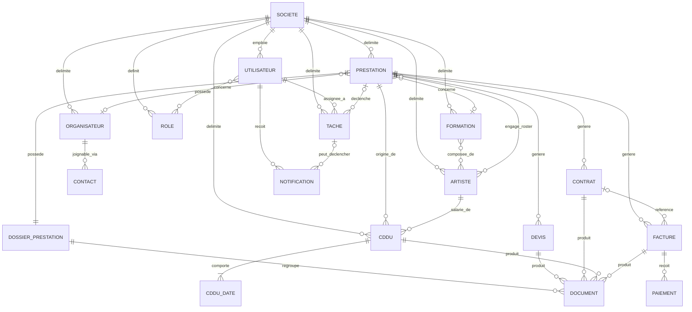
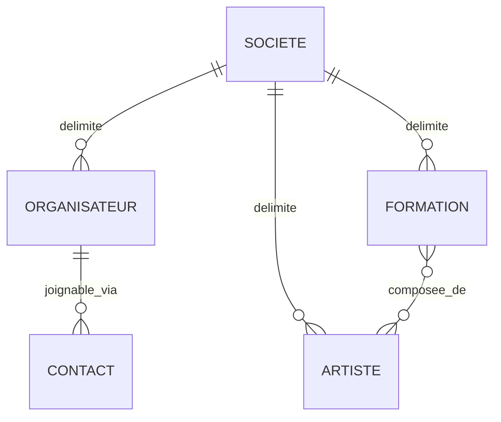
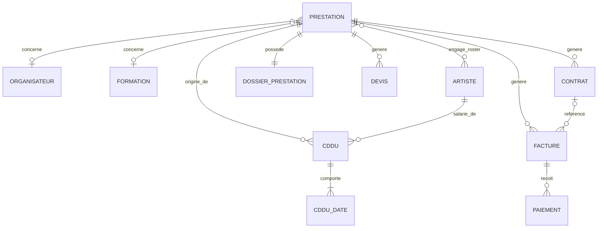
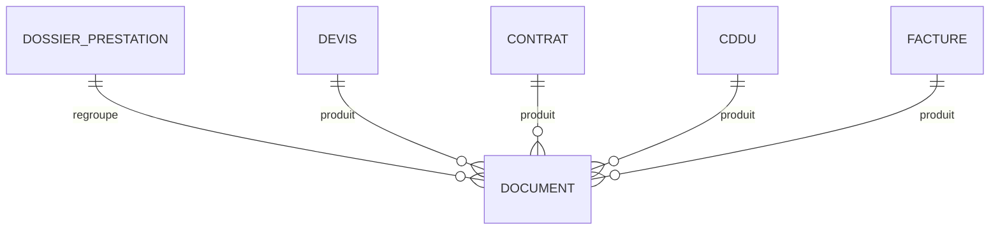
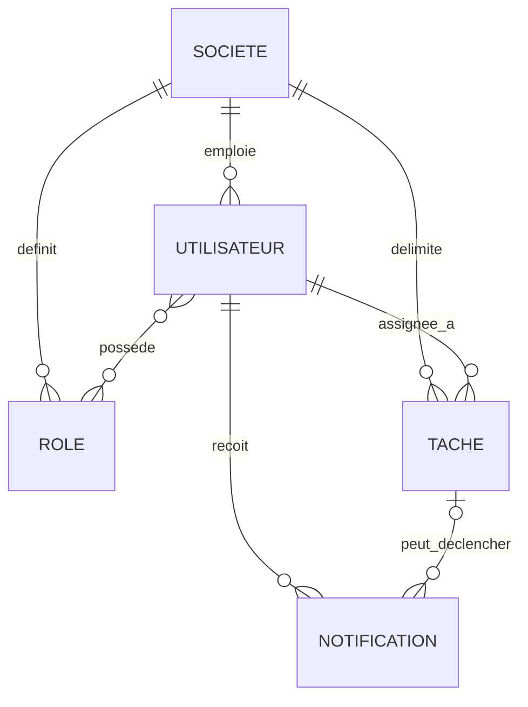

# Database — Modèle de données conceptuel — YGNT Manager Web

Software Design Specification — Document de cadrage n°6
Statut : **Brouillon Sprint 0 — en attente de validation**
Périmètre : structure logique des données uniquement. Ce document ne décrit
ni FastAPI, ni React, ni SQL, ni PostgreSQL, ni Prisma, ni ORM, ni
migrations, ni performances, ni architecture technique — ces sujets
relèvent de `06_ARCHITECTURE.md` et `07_API.md`. Aucun `CREATE TABLE`,
aucun SQL, aucun code : ce document reste un **modèle conceptuel de
données** (entités, attributs, clés, relations), pas un schéma physique.

Base normative : `00_PRODUCT_VISION.md`, `01_PRODUCT_PRINCIPLES.md`,
`02_DOMAIN_MODEL.md`, `03_UX_ARCHITECTURE.md`, `04_USE_CASES.md`. Chaque
entité, attribut et contrainte ci-dessous traduit une règle déjà validée ;
rien n'est inventé. Là où le Domain Model a explicitement délégué une
décision à ce document (ex. : format de référence de la Prestation,
`02_DOMAIN_MODEL.md` §3.8), elle est tranchée ici et justifiée. Partout
ailleurs, un point non couvert par les documents précédents est consolidé
en [§8. Décisions à arbitrer](#8-décisions-à-arbitrer) plutôt qu'inventé.

---

## Table des matières

1. [Principes](#1-principes)
2. [Entités](#2-entités)
3. [Relations](#3-relations)
4. [Diagrammes ERD](#4-diagrammes-erd)
5. [Règles d'intégrité](#5-règles-dintégrité)
6. [Index logiques](#6-index-logiques)
7. [Évolutions futures](#7-évolutions-futures)
8. [Décisions à arbitrer](#8-décisions-à-arbitrer)
9. [Checklist de validation](#9-checklist-de-validation)

---

## 1. Principes

Ces sept principes gouvernent l'ensemble du modèle. Chaque entité décrite en
§2 les applique sans exception.

### 1.1 Multi-tenant

Traduction directe de la décision Option C (`00_PRODUCT_VISION.md` §5) :
toute donnée métier appartient, directement ou transitivement, à exactement
une Société. Aucune donnée n'existe hors du périmètre d'une Société.

### 1.2 Une Société possède ses données

Corollaire du principe précédent : chaque entité « ancre » du Répertoire et
du Cœur métier (Utilisateur, Organisateur, Artiste, Formation, Prestation,
Rôle) porte un rattachement **direct** à sa Société. Les entités qui ne
peuvent exister que sous une entité déjà rattachée à une Société (un
Contact sous un Organisateur, un Devis sous une Prestation...) en héritent
**transitivement**, sans porter de rattachement redondant — voir §1.3.

### 1.3 Aucune duplication inutile

Traduction du principe déjà validé (`01_PRODUCT_PRINCIPLES.md` §3.2) : une
information n'est stockée qu'à un seul endroit.
- Une entité dépendante n'a pas besoin de porter sa propre référence à la
  Société si elle est déjà rattachée, obligatoirement et sans ambiguïté, à
  une entité qui la porte (ex. : un Devis se rattache à une Prestation, qui
  se rattache elle-même à une Société — le Devis n'a pas besoin d'un lien
  direct supplémentaire vers la Société).
- Aucun montant n'est stocké deux fois : ce qui peut être calculé à partir
  d'une autre donnée est un **champ dérivé** (§2), jamais dupliqué.

### 1.4 Intégrité référentielle

Toute référence d'une entité vers une autre doit pointer vers une entité
existante et appartenir à la même Société — une relation ne traverse
**jamais** la frontière d'une Société (voir §5).

### 1.5 Instantanés figés des documents

Traduction de la règle déjà validée (`02_DOMAIN_MODEL.md` §5, règle 4) : un
Contrat ou un CDDU déjà généré conserve une copie figée des informations
Organisateur/Formation/Artiste au moment de sa création. Modifier la fiche
d'origine ensuite ne modifie jamais rétroactivement le document déjà généré.

### 1.6 Suppression logique

Traduction de la règle déjà validée (`02_DOMAIN_MODEL.md` §5, règle 7) :
aucune entité rattachée à un document déjà généré ou signé n'est supprimée
physiquement. Elle passe à un statut logique (archivée, annulée, inactive)
qui la retire des vues actives sans perdre l'historique.

### 1.7 Traçabilité

Toute création et toute modification significative doit pouvoir être datée.
Ce principe justifie la présence systématique d'une date de création (et,
quand pertinent, d'une date de dernière modification) dans les attributs de
chaque entité en §2, sans qu'il soit nécessaire de le répéter à chaque
fiche.

---

## 2. Entités

Pour chaque entité : description, attributs (nature conceptuelle, jamais un
type SQL), clé primaire, clés étrangères, contraintes métier, champs
dérivés. Les dix-sept entités du Domain Model sont toutes couvertes,
complétées par deux entités de liaison strictement nécessaires pour porter
des données déjà validées par ailleurs (roster d'une Prestation, dates
travaillées d'un CDDU) — signalées comme telles.

Convention de lecture des attributs : *Texte*, *Texte long*, *Date*,
*Montant*, *Nombre*, *Booléen*, *Énumération* (liste de valeurs fermée) ou
*Référence* (pointeur conceptuel vers une autre entité, détaillé en clé
étrangère).

### 2.1 Société (Tenant)

**Description** — Reprend `02_DOMAIN_MODEL.md` §3.1 : l'espace de travail
isolé d'un producteur de spectacles.

| Attribut | Nature | Obligatoire | Remarque |
|---|---|---|---|
| Nom de la Société | Texte | Oui | Identité de l'espace de travail |
| Forme juridique | Texte | Non | |
| SIRET | Texte | Non | |
| Adresse, code postal, ville | Texte | Non | Réutilisés dans les documents générés |
| Email de contact | Texte | Non | |
| Statut | Énumération | Oui | Valeurs non arrêtées — voir §8 |
| Date de création | Date | Oui | Traçabilité (§1.7) |

**Clé primaire** — Identifiant unique de la Société.
**Clés étrangères** — Aucune : la Société est la racine de l'isolation
multi-tenant.
**Contraintes métier** — Aucune donnée d'une autre entité ne référence deux
Sociétés à la fois (§1.4). Une Société doit conserver au moins un
Utilisateur responsable (mécanisme exact non défini,
`02_DOMAIN_MODEL.md` §9 point 1).
**Champs dérivés** — Aucun.

### 2.2 Utilisateur

**Description** — Reprend `02_DOMAIN_MODEL.md` §3.2.

| Attribut | Nature | Obligatoire | Remarque |
|---|---|---|---|
| Nom, prénom | Texte | Oui | |
| Email | Texte | Oui | Nécessaire à l'authentification (hors périmètre ici) |
| Statut | Énumération | Oui | invité/actif/suspendu/désactivé — détail non arrêté, `02_DOMAIN_MODEL.md` §9 pt 2 |
| Date de création | Date | Oui | |

**Clé primaire** — Identifiant unique de l'Utilisateur.
**Clés étrangères** — Société (obligatoire, une seule — sauf si
l'appartenance multi-Société est validée, `02_DOMAIN_MODEL.md` §9 pt 2).
**Contraintes métier** — Un Utilisateur possède au moins un Rôle
(`02_DOMAIN_MODEL.md` §3.2).
**Champs dérivés** — Aucun.

### 2.3 Rôle

**Description** — Reprend `02_DOMAIN_MODEL.md` §3.3.

| Attribut | Nature | Obligatoire | Remarque |
|---|---|---|---|
| Nom du Rôle | Texte | Oui | |
| Description | Texte long | Non | |
| Permissions accordées | Énumération (liste) | Oui | Contenu exact non arrêté — voir §8 |

**Clé primaire** — Identifiant unique du Rôle.
**Clés étrangères** — Société (obligatoire) : « aucun Rôle n'a de portée
transversale entre Sociétés » (`02_DOMAIN_MODEL.md` §3.3).
**Contraintes métier** — Scopé à une seule Société.
**Champs dérivés** — Aucun.
**Relation avec Utilisateur** — Association N↔N (« Affectation de Rôle ») :
un Utilisateur possède un ou plusieurs Rôles, un Rôle est porté par zéro ou
plusieurs Utilisateurs. Cette association ne porte, à ce stade, aucun
attribut propre connu.

### 2.4 Organisateur

**Description** — Reprend `02_DOMAIN_MODEL.md` §3.4 et
`docs/BUSINESS_RULES.md`.

| Attribut | Nature | Obligatoire | Remarque |
|---|---|---|---|
| Nom | Texte | Oui | |
| Forme juridique | Texte | Non | |
| Adresse du siège social, code postal, ville | Texte | Non | **Jamais** le lieu de la Prestation (`02_DOMAIN_MODEL.md` §3.4) |
| SIRET | Texte | Non | |
| TVA intracommunautaire | Texte | Non | |
| IBAN, BIC | Texte | Non | |
| Représentant, fonction | Texte | Non | |
| Notes | Texte long | Non | |
| Date de création | Date | Oui | |

**Clé primaire** — Identifiant unique de l'Organisateur.
**Clés étrangères** — Société (obligatoire).
**Contraintes métier** — Nom obligatoire ; adresse strictement distincte du
lieu de la Prestation (§1.5 induit : cette distinction protège aussi
l'instantané figé du Contrat).
**Champs dérivés** — Aucun.

### 2.5 Contact

**Description** — Reprend `02_DOMAIN_MODEL.md` §3.5. N'existe pas côté
Desktop ; évolution propre au Web.

| Attribut | Nature | Obligatoire | Remarque |
|---|---|---|---|
| Nom | Texte | Oui | |
| Fonction | Texte | Non | |
| Téléphone | Texte | Non | |
| Email | Texte | Non | |

**Clé primaire** — Identifiant unique du Contact.
**Clés étrangères** — Organisateur (obligatoire). Pas de rattachement direct
à la Société (héritage transitif via l'Organisateur, §1.3).
**Contraintes métier** — Multiplicité par Organisateur et notion de contact
« principal » non tranchées (`02_DOMAIN_MODEL.md` §9 pt 4) — voir §8.
**Champs dérivés** — Aucun.

### 2.6 Artiste

**Description** — Reprend `02_DOMAIN_MODEL.md` §3.6.

| Attribut | Nature | Obligatoire | Remarque |
|---|---|---|---|
| Nom légal | Texte | Voir contrainte | Au moins l'un des deux (nom légal / nom de scène) |
| Nom de scène | Texte | Voir contrainte | |
| Adresse, code postal, ville | Texte | Non | |
| SIREN/SIRET | Texte | Non | Si applicable |
| IBAN, BIC | Texte | Non | |
| Numéro de sécurité sociale | Texte | Non | Nécessaire au CDDU |
| Lieu et date de naissance | Texte / Date | Non | Nécessaire au CDDU |
| Numéro de congés spectacle | Texte | Non | Nécessaire au CDDU |
| Fonction / instrument | Texte | Non | |
| Cachet habituel | Montant | Non | Valeur par défaut, jamais figée |

**Clé primaire** — Identifiant unique de l'Artiste.
**Clés étrangères** — Société (obligatoire).
**Contraintes métier** — Au moins un nom (légal ou de scène) obligatoire.
**Champs dérivés** — Aucun.

### 2.7 Formation

**Description** — Reprend `02_DOMAIN_MODEL.md` §3.7 : l'unité commerciale
vendue, distincte des personnes qui l'exécutent.

| Attribut | Nature | Obligatoire | Remarque |
|---|---|---|---|
| Nom du spectacle | Texte | Oui | |
| Cachet de cession habituel | Montant | Non | Distinct du cachet salarié individuel d'un Artiste |

**Clé primaire** — Identifiant unique de la Formation.
**Clés étrangères** — Société (obligatoire).
**Contraintes métier** — La composition (Artistes membres) est non tranchée
en cardinalité — voir §8.
**Champs dérivés** — Aucun.
**Relation avec Artiste** — Association N↔N (« Composition de la
Formation »), cardinalité exacte non tranchée
(`02_DOMAIN_MODEL.md` §9 pt 5) — voir §8.

### 2.8 Prestation

**Description** — Reprend `02_DOMAIN_MODEL.md` §3.8 : l'entité centrale.

| Attribut | Nature | Obligatoire | Remarque |
|---|---|---|---|
| Référence | Texte, unique par Société | Oui | Voir décision de format ci-dessous |
| Type d'événement | Énumération | Oui | mariage / festival / mairie / comité d'entreprise / anniversaire / soirée privée / autre (repris `docs/PRESTATIONS_ARCHITECTURE.md` §6) |
| Nom | Texte | Oui | |
| Statut | Énumération | Oui | Prospection → Devis envoyé → Confirmée → Réalisée → Facturée → Soldée → Archivée, ou Annulée (`02_DOMAIN_MODEL.md` §6.2) |
| Date de début | Date | Oui | |
| Date de fin | Date | Non | Événements multi-jours |
| Lieu (nom, adresse, code postal, ville) | Texte | Non | **Strictement distinct** du siège de l'Organisateur |
| Notes | Texte long | Non | |
| Date de création | Date | Oui | |

**Clé primaire** — Identifiant unique de la Prestation.
**Clés étrangères** — Société (obligatoire) ; Organisateur (optionnel) ;
Formation (optionnel).
**Contraintes métier** — Organisateur et Formation non obligatoires à la
création ; une Prestation = un événement unique, sans imbrication.
**Champs dérivés** — **Montant** : jamais stocké, toujours calculé à partir
du Devis/Contrat/Facture le plus pertinent qui lui est rattaché
(`02_DOMAIN_MODEL.md` §3.8).

> **Décision tranchée ici** (déléguée par `02_DOMAIN_MODEL.md` §3.8) — la
> référence de la Prestation reprend le format déjà validé côté Desktop :
> `PREST-{année}-{séquence sur 4 chiffres}`, la séquence se basant sur la
> dernière référence attribuée pour l'année en cours au sein de la même
> Société (jamais un comptage total), pour rester correcte après archivage
> ou annulation. **Unicité par Société**, pas globale à la plateforme —
> conséquence directe du principe d'isolation multi-tenant (§1.1).

### 2.9 Dossier de prestation

**Description** — Reprend `02_DOMAIN_MODEL.md` §3.9 : vue consolidée, pas un
conteneur de données propre.

**Attributs** — Aucun attribut métier propre significatif : le Dossier
n'ajoute aucune donnée que la Prestation ou les documents rattachés ne
portent déjà (§1.3).

**Clé primaire** — Identifiant unique du Dossier (ou, plus simplement,
partage l'identifiant de sa Prestation — relation 1:1 stricte).
**Clés étrangères** — Prestation (obligatoire, unique).
**Contraintes métier** — Une Prestation possède toujours exactement un
Dossier, jamais zéro, jamais plusieurs.
**Champs dérivés** — Tout son contenu utile (documents transactionnels
associés) est **dérivé par requête croisée** sur la Prestation, jamais
dupliqué (`02_DOMAIN_MODEL.md` §3.9). Seules les pièces jointes libres
(entité Document, §2.16) lui sont réellement rattachées.

### 2.10 Devis

**Description** — Reprend `02_DOMAIN_MODEL.md` §3.10.

| Attribut | Nature | Obligatoire | Remarque |
|---|---|---|---|
| Référence | Texte | Oui | Format non tranché — voir §8 |
| Montant | Montant | Oui | |
| Conditions | Texte long | Non | |
| Statut | Énumération | Oui | Liste non tranchée — voir §8 |
| Date de création | Date | Oui | |
| Date d'envoi | Date | Non | |

**Clé primaire** — Identifiant unique du Devis.
**Clés étrangères** — Prestation (obligatoire) ; Organisateur (obligatoire,
généralement celui de la Prestation).
**Contraintes métier** — Un Contrat n'exige pas nécessairement un Devis
préalable.
**Champs dérivés** — Aucun identifié à ce stade.

### 2.11 Contrat

**Description** — Reprend intégralement `02_DOMAIN_MODEL.md` §3.11 et
`docs/BUSINESS_RULES.md`. Contrat de cession, distinct du CDDU.

| Attribut | Nature | Obligatoire | Remarque |
|---|---|---|---|
| Référence | Texte, unique par Société | Oui | Voir décision et point ouvert ci-dessous |
| Statut | Énumération | Oui | Brouillon / Validé / Signé — informatif, ne bloque aucune action |
| Instantané Organisateur (nom, adresse, SIRET...) | Texte | Oui à la génération | Figé (§1.5) |
| Instantané Formation (nom, cachet) | Texte / Montant | Non | Figé (§1.5) |
| Cachet de cession | Montant | Non | |
| Acompte | Montant | Non | |
| Taux de TVA | Nombre | Non | |
| Mode de paiement | Énumération | Non | Virement / Chèque (repris du Desktop) |
| Échéance de règlement | Date | Non | |
| Date de création | Date | Oui | |

**Clé primaire** — Identifiant unique du Contrat.
**Clés étrangères** — Prestation (obligatoire) ; Organisateur (obligatoire) ;
Formation (optionnel).
**Contraintes métier** — Organisateur et nom du spectacle strictement
obligatoires, le reste peut être complété plus tard ; la duplication crée un
nouveau Brouillon, nouvelle référence, sans document déjà généré.
**Champs dérivés** — Aucun.

> **Point ouvert repéré à ce niveau de détail** — `docs/BUSINESS_RULES.md`
> fixe le format `YGNT-{année}-{séquence}`, où « YGNT » est le nom de la
> société de production actuelle du Desktop. En contexte multi-tenant, ce
> préfixe littéral n'a plus de sens générique : chaque Société ne peut pas
> toutes numéroter leurs contrats « YGNT-... ». Le format exact pour le Web
> (préfixe neutre, préfixe personnalisable par Société, ou autre) n'est pas
> tranché — voir §8.

### 2.12 CDDU

**Description** — Reprend intégralement `02_DOMAIN_MODEL.md` §3.12 et
`docs/CDDU_ARCHITECTURE.md`. Contrat de travail, indépendant de
l'Organisateur.

| Attribut | Nature | Obligatoire | Remarque |
|---|---|---|---|
| Référence | Texte, unique par Société | Oui | Format Desktop repris : `CDDU-{année}-{séquence}` — préfixe déjà générique, aucun point ouvert identifié |
| Statut | Énumération | Oui | Brouillon → Validé → PDF généré → Envoyé → Signé → Archivé |
| Instantané Société (employeur) | Texte | Oui à la génération | Figé (§1.5) |
| Instantané Artiste (salarié) | Texte | Oui à la génération | Figé (§1.5) |
| Rémunération brute | Montant | Non | Saisie manuelle |
| Défraiements (déplacement, hébergement, repas, autres) | Montant | Non | Tous optionnels |
| Observations | Texte long | Non | |
| Date de création | Date | Oui | |

**Clé primaire** — Identifiant unique du CDDU.
**Clés étrangères** — Société (obligatoire, employeur) ; Artiste (obligatoire,
salarié) ; Prestation d'origine (optionnelle, informative).
**Contraintes métier** — Le salarié est toujours un Artiste, jamais une
Formation ; jamais de lien direct à un Organisateur.
**Champs dérivés** — **Date de début / date de fin** : dérivées (minimum et
maximum des dates travaillées, §2.13), jamais stockées séparément
(`docs/CDDU_ARCHITECTURE.md` §4). **Nombre total de cachets** : dérivé
(somme des dates travaillées).

### 2.13 CDDU — Date travaillée *(entité de liaison)*

**Description** — Porte les dates individuelles d'un CDDU. Nécessaire pour
que les champs dérivés du CDDU (§2.12) existent réellement ; reprend
`docs/CDDU_ARCHITECTURE.md` §5, déjà cité comme référence par le Domain
Model pour le CDDU.

| Attribut | Nature | Obligatoire | Remarque |
|---|---|---|---|
| Date travaillée | Date | Oui | |
| Nombre de cachets | Nombre | Oui | Défaut : 1 |

**Clé primaire** — Identifiant unique de la ligne.
**Clés étrangères** — CDDU (obligatoire) ; Prestation d'origine de cette
date précise (optionnelle).
**Contraintes métier** — Un CDDU « simple » porte exactement une ligne ; un
CDDU « mensualisé » en porte plusieurs, potentiellement sur des Prestations
différentes (`docs/CDDU_ARCHITECTURE.md` §6, §7). Une date déjà couverte par
un CDDU actif (non archivé) pour le même Artiste ne doit jamais être
recréée par erreur (`02_DOMAIN_MODEL.md` §5, règle 9).
**Champs dérivés** — Aucun.

### 2.14 Facture

**Description** — Reprend `02_DOMAIN_MODEL.md` §3.13.

| Attribut | Nature | Obligatoire | Remarque |
|---|---|---|---|
| Référence | Texte | Oui | Format non tranché — voir §8 |
| Montant | Montant | Oui | |
| Échéance de règlement | Date | Non | |
| Statut | Énumération | Oui | Liste non tranchée — voir §8 |
| Date de création | Date | Oui | |

**Clé primaire** — Identifiant unique de la Facture.
**Clés étrangères** — Prestation (obligatoire) ; Contrat (optionnel, lien
non obligatoire selon les règles connues).
**Contraintes métier** — Le solde restant dû n'est jamais stocké
indépendamment.
**Champs dérivés** — **Solde restant dû** : dérivé (montant de la Facture
moins la somme des Paiements rattachés, §2.15).

### 2.15 Paiement

**Description** — Reprend `02_DOMAIN_MODEL.md` §3.14.

| Attribut | Nature | Obligatoire | Remarque |
|---|---|---|---|
| Montant | Montant | Oui | |
| Date de paiement | Date | Oui | |
| Mode de paiement | Énumération | Oui | Liste non confirmée pour la Facture — voir §8 |

**Clé primaire** — Identifiant unique du Paiement.
**Clés étrangères** — Facture (obligatoire, une seule).
**Contraintes métier** — Un Paiement se rattache à une seule Facture ;
traitement d'un trop-perçu non défini (`02_DOMAIN_MODEL.md` §9 pt 9) — voir
§8.
**Champs dérivés** — Aucun.

### 2.16 Document

**Description** — Reprend `02_DOMAIN_MODEL.md` §3.15. Couvre à la fois les
documents générés (Devis/Contrat/CDDU/Facture) et les pièces jointes
libres.

| Attribut | Nature | Obligatoire | Remarque |
|---|---|---|---|
| Nom du fichier | Texte | Oui | |
| Catégorie | Énumération | Oui | pièce jointe / photo / rider / plan de scène / autorisation / autre (repris `docs/PRESTATIONS_ARCHITECTURE.md` §4) |
| Origine | Énumération | Oui | généré (depuis un document transactionnel) ou déposé librement |
| Emplacement de stockage | Référence | Oui | Conceptuel ici — le mécanisme technique relève de `06_ARCHITECTURE.md` |
| Date d'ajout | Date | Oui | |

**Clé primaire** — Identifiant unique du Document.
**Clés étrangères** — Dossier de prestation (obligatoire, via la Prestation)
; et, si le Document est généré, une référence optionnelle vers son document
d'origine (Devis, Contrat, CDDU ou Facture — un seul renseigné à la fois).
**Contraintes métier** — Un Document généré n'existe que si son document
d'origine existe ; il n'est jamais une donnée saisie indépendamment.
**Champs dérivés** — Aucun.

### 2.17 Tâche

**Description** — Reprend `02_DOMAIN_MODEL.md` §3.16. Support du Cockpit.

| Attribut | Nature | Obligatoire | Remarque |
|---|---|---|---|
| Nature / type | Énumération | Oui | Liste exhaustive non arrêtée — voir §8 |
| Description | Texte | Oui | |
| Origine | Énumération | Oui | automatique (Système) ou manuelle (Utilisateur) |
| Statut | Énumération | Oui | traitée / non traitée |
| Date de création | Date | Oui | |

**Clé primaire** — Identifiant unique de la Tâche.
**Clés étrangères** — Société (obligatoire, directe : une Tâche n'est pas
toujours liée à une Prestation) ; Utilisateur assigné (optionnel) ;
Prestation concernée (optionnelle) ; Document concerné (optionnel).
**Contraintes métier** — Jamais visible hors de sa Société (§1.1).
**Champs dérivés** — Aucun.

### 2.18 Notification

**Description** — Reprend `02_DOMAIN_MODEL.md` §3.17. Peu de règles connues
à ce stade.

| Attribut | Nature | Obligatoire | Remarque |
|---|---|---|---|
| Message | Texte | Oui | |
| Statut | Énumération | Oui | non lue / lue |
| Date de création | Date | Oui | |

**Clé primaire** — Identifiant unique de la Notification.
**Clés étrangères** — Utilisateur destinataire (obligatoire) ; Tâche
d'origine (optionnelle).
**Contraintes métier** — Aucune contrainte ferme au-delà du rattachement à
un Utilisateur — voir §8.
**Champs dérivés** — Aucun.

---

## 3. Relations

Notation Merise : `(min,max)` de part et d'autre de chaque relation. Lu de
gauche à droite : « une Entité A est liée à (min,max) Entité B ».

| Entité A | Relation | Entité B | Card. A | Card. B | Remarque |
|---|---|---|---|---|---|
| Société | emploie | Utilisateur | (1,1) | (0,N) | §1.1 |
| Société | délimite | Organisateur | (1,1) | (0,N) | §1.1 |
| Société | délimite | Artiste | (1,1) | (0,N) | §1.1 |
| Société | délimite | Formation | (1,1) | (0,N) | §1.1 |
| Société | délimite | Prestation | (1,1) | (0,N) | §1.1 |
| Société | définit | Rôle | (1,1) | (0,N) | Scopage non définitif — §8 |
| Société | délimite | CDDU | (1,1) | (0,N) | CDDU = employeur, rattachement direct |
| Société | délimite | Tâche | (1,1) | (0,N) | Tâche n'est pas toujours liée à une Prestation |
| Utilisateur | possède | Rôle | (1,N) | (0,N) | Association N↔N |
| Organisateur | est joignable via | Contact | (1,1) | (0,N) | Multiplicité exacte — §8 |
| Formation | est composée de | Artiste | (0,N) | (0,N) | Cardinalité exacte non tranchée — §8 |
| Prestation | concerne | Organisateur | (0,1) | (0,N) | Optionnel à la création |
| Prestation | concerne | Formation | (0,1) | (0,N) | Optionnel à la création |
| Prestation | engage (roster réel) | Artiste | (0,N) | (0,N) | Distinct de la composition de la Formation |
| Prestation | possède | Dossier de prestation | (1,1) | (1,1) | Relation 1:1 stricte |
| Prestation | génère | Devis | (1,1) | (0,N) | |
| Prestation | génère | Contrat | (1,1) | (0,N) | |
| Prestation | génère | Facture | (1,1) | (0,N) | |
| Prestation | est à l'origine de | CDDU | (0,1) | (0,N) | Informatif, non structurant |
| Artiste | est salarié via | CDDU | (1,1) | (0,N) | Jamais la Formation |
| CDDU | comporte | Date travaillée | (1,1) | (1,N) | Toujours au moins une ligne |
| Contrat | référencé par | Facture | (0,1) | (0,N) | Lien non obligatoire |
| Facture | reçoit | Paiement | (1,1) | (0,N) | |
| Dossier de prestation | regroupe | Document (libre) | (1,1) | (0,N) | |
| Devis / Contrat / CDDU / Facture | produit | Document (généré) | (1,1) | (0,N) | Un seul document d'origine par Document généré |
| Utilisateur | est assigné à | Tâche | (0,1) | (0,N) | Optionnel |
| Prestation | déclenche | Tâche | (0,1) | (0,N) | Optionnel |
| Utilisateur | reçoit | Notification | (1,1) | (0,N) | |
| Tâche | peut déclencher | Notification | (0,1) | (0,N) | Relation supposée — §8 |

---

## 4. Diagrammes ERD

### 4.1 Diagramme global

### 4.2 Domaine Répertoire

### 4.3 Domaine Prestations

### 4.4 Domaine Documents

### 4.5 Domaine Administration

---

## 5. Règles d'intégrité

1. **Isolation multi-tenant absolue** — aucune relation ne traverse la
   frontière d'une Société ; une Prestation, un Organisateur, un Artiste,
   une Formation, un Utilisateur, un Rôle, une Tâche, une CDDU ne
   référencent jamais une entité d'une autre Société (§1.1, §1.4).
2. **Une Facture appartient à une seule Prestation.**
3. **Un Paiement appartient à une seule Facture.**
4. **Un Contrat conserve son instantané** Organisateur/Formation figé à sa
   création ; une modification ultérieure de l'Organisateur ou de la
   Formation d'origine ne le modifie jamais rétroactivement (§1.5).
5. **Un CDDU conserve son instantané** Société/Artiste figé à sa création,
   au même titre que le Contrat (§1.5).
6. **Un CDDU référence toujours un Artiste, jamais une Formation** —
   contrainte structurelle, pas seulement une convention d'interface
   (`02_DOMAIN_MODEL.md` §5, règle 5).
7. **Une suppression est toujours logique**, jamais physique, dès qu'une
   entité (Organisateur, Artiste, Prestation) est rattachée à un document
   déjà généré ou signé (§1.6).
8. **Les références sont uniques par Société**, pas globalement à la
   plateforme (Prestation, Contrat, CDDU — et Devis/Facture une fois leur
   format arbitré, §8).
9. **Un Dossier de prestation existe pour, et seulement pour, une
   Prestation** — relation 1:1 stricte, jamais 0 ni plusieurs.
10. **Une Date travaillée de CDDU appartient à un seul CDDU** ; une même
    date, pour un même Artiste, ne doit pas être couverte par deux CDDU
    actifs simultanément (§5 du Domain Model, règle 9).
11. **Un Document généré référence au plus un document transactionnel
    d'origine** (Devis, Contrat, CDDU ou Facture — jamais plusieurs à la
    fois).
12. **Aucun montant n'est stocké s'il peut être dérivé** — montant de la
    Prestation, solde de la Facture, dates et nombre de cachets du CDDU
    (§1.3, champs dérivés listés en §2).
13. **Une Tâche et une Notification n'existent que rattachées à une
    Société** (via leur Utilisateur ou leur rattachement direct), jamais en
    dehors de ce périmètre.

---

## 6. Index logiques

Sans aucune considération technique (ni SQL, ni moteur de base de données) :
ces champs devront être indexés, c'est-à-dire retrouvables rapidement,
parce que des cas d'utilisation déjà validés en dépendent directement.

| Champ | Entité(s) | Justifié par |
|---|---|---|
| Référence | Prestation, Contrat, CDDU (et Devis/Facture une fois arbitrés) | Identification directe, recherche globale (`04_USE_CASES.md` UC-37) |
| Nom | Organisateur, Artiste, Formation | Recherche globale et locale (UC-37, UC-38) |
| Email | Utilisateur, Contact | Authentification, prise de contact |
| Date (début, échéance) | Prestation, Facture, Date travaillée du CDDU | Vue Calendrier (`03_UX_ARCHITECTURE.md` §6.3), filtres par période |
| Statut | Prestation, Contrat, CDDU, Devis, Facture, Tâche | Vue Kanban (§6.2 UX Architecture), filtres (§5 UX Architecture), Cockpit |
| Rattachement Société | Toutes les entités concernées (§1.2) | Isolation multi-tenant sur **chaque** lecture, sans exception |
| Rattachement Prestation | Devis, Contrat, CDDU, Facture, Document, Tâche | Reconstitution du Dossier de prestation (§2.9) |
| Utilisateur assigné | Tâche | Filtre « Mes actions » du Cockpit (`00_PRODUCT_VISION.md` §7) |

---

## 7. Évolutions futures

*(cohérentes avec `00_PRODUCT_VISION.md` §13, non engageantes)*

- Si l'appartenance d'un Utilisateur à plusieurs Sociétés est validée
  (`02_DOMAIN_MODEL.md` §9 pt 2), la relation Société↔Utilisateur devient
  elle-même N↔N et nécessitera une association dédiée.
- Si un portail externe pour les Organisateurs est retenu
  (`00_PRODUCT_VISION.md` §13), le Contact (§2.5) devient potentiellement
  un point d'entrée d'authentification, avec ses propres contraintes
  d'accès — hors périmètre de ce document.
- Si la Timeline (jalons métier chronologiques,
  `02_DOMAIN_MODEL.md` §9 pt 6) est confirmée comme entité à part entière
  plutôt qu'une simple responsabilité du Dossier, elle rejoindra ce modèle
  comme une nouvelle entité rattachée à la Prestation.
- Si le portail externe ou une ouverture commerciale multi-tenant publique
  est un jour engagée (`00_PRODUCT_VISION.md` §13), le principe d'isolation
  (§1.1) reste inchangé : il a été conçu dès ce document pour supporter ce
  passage à l'échelle sans remise en cause du modèle.

---

## 8. Décisions à arbitrer

1. **§2.1 Société** — statuts possibles d'une Société — hérité de
   `02_DOMAIN_MODEL.md` §9 pt 1.
2. **§2.2 Utilisateur** — appartenance à une ou plusieurs Sociétés, états
   précis du cycle de vie — hérité de `02_DOMAIN_MODEL.md` §9 pt 2.
3. **§2.3 Rôle** — liste définitive des Rôles et de leurs permissions ;
   Rôles figés par le produit ou personnalisables par Société — hérité de
   `02_DOMAIN_MODEL.md` §9 pt 3.
4. **§2.5 Contact** — multiplicité exacte par Organisateur, notion de
   contact « principal » — hérité de `02_DOMAIN_MODEL.md` §9 pt 4.
5. **§2.7 Formation** — cardinalité exacte de la composition
   Formation↔Artiste — hérité de `02_DOMAIN_MODEL.md` §9 pt 5.
6. **§2.9 Dossier de prestation** — la Timeline doit-elle devenir une
   entité à part entière ? — hérité de `02_DOMAIN_MODEL.md` §9 pt 6.
7. **§2.10 Devis** — format de référence, liste définitive des statuts —
   hérité de `02_DOMAIN_MODEL.md` §9 pt 7.
8. **§2.11 Contrat** — **nouveau point identifié à ce niveau de détail** :
   le préfixe littéral « YGNT » du format Desktop n'est pas généralisable à
   plusieurs Sociétés clientes ; un format neutre ou personnalisable par
   Société doit être choisi.
9. **§2.14 Facture** — format de référence, liste définitive des statuts,
   obligation ou non d'un Contrat préalable — hérité de
   `02_DOMAIN_MODEL.md` §9 pt 8.
10. **§2.15 Paiement** — liste des modes de paiement acceptés, traitement
    d'un trop-perçu — hérité de `02_DOMAIN_MODEL.md` §9 pt 9.
11. **§2.17 Tâche** — liste exhaustive des types de Tâches générées
    automatiquement — hérité de `02_DOMAIN_MODEL.md` §9 pt 10.
12. **§2.18 Notification** — canaux de diffusion, événements exacts
    déclencheurs, relation précise avec la Tâche — hérité de
    `02_DOMAIN_MODEL.md` §9 pt 11.
13. **§3** — scopage exact du Rôle (par Société ou catalogue global de
    types de Rôles) — reformulation du point 3 sous l'angle relationnel.

---

## 9. Checklist de validation

- [ ] Les sept principes (§1) sont validés sans réserve.
- [ ] Les dix-sept entités du Domain Model, plus les deux entités de
      liaison identifiées (§2.9 note, §2.13), sont toutes couvertes avec
      leurs attributs, clé primaire, clés étrangères, contraintes et champs
      dérivés.
- [ ] Le format de référence de la Prestation, tranché en §2.8, est validé.
- [ ] Le point ouvert sur le préfixe « YGNT » du Contrat (§2.11, §8 pt 8)
      est arbitré.
- [ ] Les relations et cardinalités (§3) sont validées telles quelles ou
      amendées.
- [ ] Les diagrammes ERD (§4) sont jugés fidèles au modèle décrit.
- [ ] Les règles d'intégrité (§5) sont validées sans réserve.
- [ ] Les index logiques proposés (§6) sont jugés pertinents.
- [ ] Chacune des 13 décisions listées en §8 a reçu une réponse explicite,
      ou est explicitement reportée à un document ultérieur.
- [ ] Ce document peut servir de référence stable pour rédiger
      `06_ARCHITECTURE.md`.
