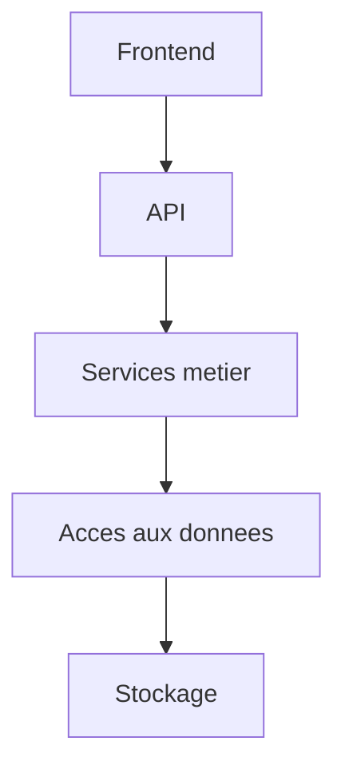
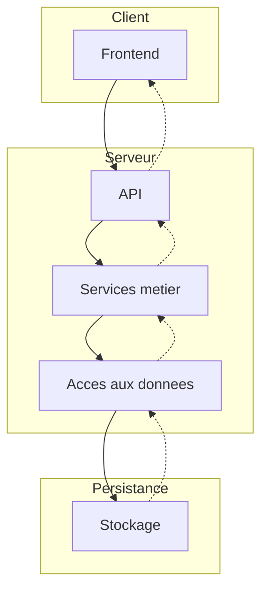
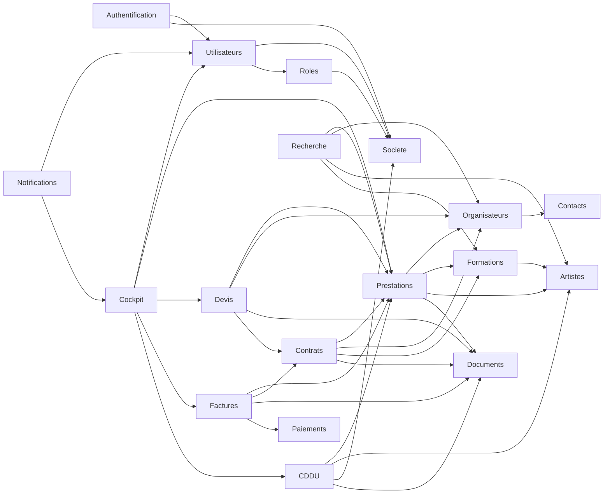
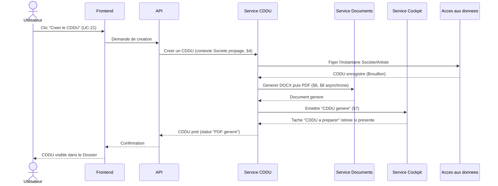

# Architecture — YGNT Manager Web

Software Design Specification — Document de cadrage n°7
Statut : **Brouillon Sprint 0 — en attente de validation**
Périmètre : architecture technique conceptuelle uniquement. Ce document ne
décrit ni les endpoints d'API (`07_API.md`), ni le code, ni les migrations,
ni l'implémentation détaillée. Aucun nom de framework, de langage, de base
de données ou de bibliothèque n'est choisi ici : le document reste
indépendant des choix d'implémentation fins, pour rester valable quelle que
soit la stack retenue ensuite.

Base normative : `00_PRODUCT_VISION.md`, `01_PRODUCT_PRINCIPLES.md`,
`02_DOMAIN_MODEL.md`, `03_UX_ARCHITECTURE.md`, `04_USE_CASES.md`,
`05_DATABASE.md`. Chaque module, principe et diagramme ci-dessous traduit
une règle déjà validée en organisation technique ; rien n'est inventé. Un
point non couvert par les documents précédents est consolidé en
[§13. Décisions à arbitrer](#13-décisions-à-arbitrer) plutôt que tranché
silencieusement.

---

## Table des matières

1. [Principes d'architecture](#1-principes-darchitecture)
2. [Vue d'ensemble](#2-vue-densemble)
3. [Découpage des modules](#3-découpage-des-modules)
4. [Multi-tenant](#4-multi-tenant)
5. [Authentification](#5-authentification)
6. [Gestion documentaire](#6-gestion-documentaire)
7. [Événements métier](#7-événements-métier)
8. [Traitements asynchrones](#8-traitements-asynchrones)
9. [Sécurité](#9-sécurité)
10. [Observabilité](#10-observabilité)
11. [Stratégie de tests](#11-stratégie-de-tests)
12. [Diagrammes](#12-diagrammes)
13. [Décisions à arbitrer](#13-décisions-à-arbitrer)
14. [Checklist de validation](#14-checklist-de-validation)

---

## 1. Principes d'architecture

### 1.1 Séparation des responsabilités

Reprend, adaptée au Web, la règle déjà en vigueur et validée côté Desktop
(`docs/PROJECT.md`) : « les fenêtres ne doivent jamais exécuter directement
de SQL, toute logique métier passe par les Services, seuls les Repositories
accèdent à la base ». La même discipline s'applique ici entre les cinq
couches décrites en §2 : **aucune couche ne saute une couche**, et aucune
couche ne porte une responsabilité qui appartient à une autre (le Frontend
ne contient aucune règle métier, le Stockage ne connaît aucune règle
métier).

### 1.2 Modularité

Chaque module décrit en §3 correspond directement à une ou plusieurs
entités du modèle de données déjà validé (`05_DATABASE.md`). Un module a une
responsabilité unique et communique avec les autres uniquement via ses
interfaces publiques, jamais en accédant directement aux données internes
d'un autre module.

### 1.3 Évolutivité

Traduction technique de la règle déjà validée sur les évolutions de schéma
(« toujours additives et rétrocompatibles », reprise du Desktop,
`docs/BUSINESS_RULES.md`, et de la logique déjà appliquée à la Prestation
côté Desktop, `docs/PRESTATIONS_ARCHITECTURE.md` §1 : « le Contrat reste
pleinement fonctionnel seul, la Prestation est une couche au-dessus, pas un
remplacement »). Un nouveau module doit pouvoir s'ajouter sans modifier les
modules existants.

### 1.4 Sécurité

L'isolation multi-tenant (§4) et les principes d'intégrité déjà validés
(`05_DATABASE.md` §1, §5) sont des propriétés de l'architecture elle-même,
pas des vérifications ajoutées après coup. Détaillé en §9.

### 1.5 Simplicité

Reprend le principe déjà validé (`01_PRODUCT_PRINCIPLES.md` §3.6) : à
complexité technique égale, l'architecture retenue est celle qui reste la
plus simple à comprendre et à faire évoluer — pas nécessairement la plus
« complète ».

### 1.6 Testabilité

Conséquence directe de la séparation des responsabilités (§1.1) : chaque
Service métier doit pouvoir être vérifié indépendamment du Frontend et du
Stockage réel. Détaillé en §11.

---

## 2. Vue d'ensemble

L'architecture générale s'organise en cinq couches, chacune ne connaissant
que la couche immédiatement inférieure :



| Couche | Rôle | Ce qu'elle ne fait jamais |
|---|---|---|
| **Frontend** | Présente l'organisation fonctionnelle déjà définie (`03_UX_ARCHITECTURE.md`) ; consomme l'API. | Ne contient aucune règle métier, aucun accès direct aux données. |
| **API** | Traduit une requête du Frontend en appel à un ou plusieurs Services métier ; ne fait qu'orchestrer. | Ne contient aucune règle métier propre (elle délègue toujours au Service). |
| **Services métier** | Implémentent les règles déjà validées (`02_DOMAIN_MODEL.md`, `04_USE_CASES.md`) : cycles de vie, contraintes, instantanés figés, dérivation des champs calculés. | N'accèdent jamais directement au Stockage. |
| **Accès aux données** | Traduit les besoins des Services en opérations sur le Stockage ; seul point de contact avec lui. | Ne contient aucune règle métier — elle exécute, elle ne décide pas. |
| **Stockage** | Persiste les données selon le modèle déjà validé (`05_DATABASE.md`). | Ne connaît aucune règle métier ; le choix technique précis est hors périmètre de ce document. |

Cette organisation reprend directement, adaptée au Web, la couche
Desktop déjà validée (`docs/PROJECT.md` : UI → Services → Repositories →
Base de données), cohérente avec le principe de cohérence Desktop/Web
(`03_UX_ARCHITECTURE.md` §7.4).

Le contexte multi-tenant (§4) traverse les cinq couches : chaque couche
propage le contexte reçu de la précédente, elle ne le redéfinit jamais.

---

## 3. Découpage des modules

Pour chaque module : responsabilité, dépendances fonctionnelles (vers
d'autres modules, jamais vers une couche), interfaces publiques
(capacités exposées, pas des routes techniques — celles-ci relèvent de
`07_API.md`).

### 3.1 Authentification

- **Responsabilité** — Vérifier l'identité d'un Utilisateur, établir une
  session, déterminer la Société active et les Rôles applicables. Module
  transverse, sans entité dédiée dans `05_DATABASE.md` (il s'appuie sur
  Utilisateurs).
- **Dépendances** — Utilisateurs, Société, Rôles.
- **Interfaces publiques** — S'authentifier ; obtenir le contexte courant
  (utilisateur, société, rôles) ; clôturer une session.

### 3.2 Société

- **Responsabilité** — Gérer l'identité et le cycle de vie de la Société
  (`05_DATABASE.md` §2.1).
- **Dépendances** — Aucune (module racine de l'isolation, §4).
- **Interfaces publiques** — Consulter/modifier les informations de la
  Société active.

### 3.3 Utilisateurs

- **Responsabilité** — Gérer les comptes Utilisateur d'une Société
  (`05_DATABASE.md` §2.2), y compris leur invitation (UC-33).
- **Dépendances** — Société, Rôles.
- **Interfaces publiques** — Inviter un utilisateur ; lister les
  utilisateurs de la Société ; modifier un utilisateur.

### 3.4 Rôles

- **Responsabilité** — Gérer les Rôles et permissions d'une Société
  (`05_DATABASE.md` §2.3).
- **Dépendances** — Société.
- **Interfaces publiques** — Lister les Rôles ; attribuer un Rôle à un
  Utilisateur (UC-34) ; **vérifier une permission** — interface consommée
  par tous les autres modules pour toute décision d'autorisation (§9).

### 3.5 Prestations

- **Responsabilité** — Cycle de vie de la Prestation, entité centrale
  (`05_DATABASE.md` §2.8, `04_USE_CASES.md` §2.2).
- **Dépendances** — Organisateurs, Formations, Artistes (roster), Documents
  (Dossier).
- **Interfaces publiques** — Créer, modifier, annuler, archiver une
  Prestation (UC-04 à UC-07) ; obtenir le Dossier consolidé d'une
  Prestation.

### 3.6 Organisateurs

- **Responsabilité** — Gérer le répertoire des Organisateurs
  (`05_DATABASE.md` §2.4).
- **Dépendances** — Société, Contacts.
- **Interfaces publiques** — Créer, modifier un Organisateur (UC-08, UC-09).

### 3.7 Contacts

- **Responsabilité** — Gérer les interlocuteurs rattachés à un Organisateur
  (`05_DATABASE.md` §2.5).
- **Dépendances** — Organisateurs.
- **Interfaces publiques** — Ajouter un contact (UC-10).

### 3.8 Artistes

- **Responsabilité** — Gérer le répertoire des Artistes
  (`05_DATABASE.md` §2.6).
- **Dépendances** — Société.
- **Interfaces publiques** — Créer, modifier, archiver un Artiste (UC-11 à
  UC-13).

### 3.9 Formations

- **Responsabilité** — Gérer les Formations et leur composition
  (`05_DATABASE.md` §2.7).
- **Dépendances** — Artistes.
- **Interfaces publiques** — Créer une Formation, ajouter/retirer un Artiste
  (UC-14 à UC-16).

### 3.10 Contrats

- **Responsabilité** — Cycle de vie du Contrat de cession, instantané figé
  (`05_DATABASE.md` §2.11).
- **Dépendances** — Prestations, Organisateurs, Formations, Documents.
- **Interfaces publiques** — Générer, modifier, dupliquer, exporter PDF
  (UC-17 à UC-20).

### 3.11 CDDU

- **Responsabilité** — Cycle de vie du contrat de travail, workflow rapide
  et mensualisation (`05_DATABASE.md` §2.12, §2.13).
- **Dépendances** — Prestations, Artistes, Société, Documents.
- **Interfaces publiques** — Créer un CDDU (workflow rapide), créer un CDDU
  mensualisé, générer DOCX, générer PDF (UC-21 à UC-24).

### 3.12 Devis

- **Responsabilité** — Cycle de vie du Devis (`05_DATABASE.md` §2.10).
- **Dépendances** — Prestations, Organisateurs, Documents, Contrats
  (transformation, UC-27).
- **Interfaces publiques** — Créer, envoyer, transformer en contrat (UC-25
  à UC-27).

### 3.13 Factures

- **Responsabilité** — Cycle de vie de la Facture (`05_DATABASE.md` §2.14).
- **Dépendances** — Prestations, Contrats (optionnel), Documents, Paiements.
- **Interfaces publiques** — Générer une facture (UC-28) ; obtenir le solde
  restant dû (champ dérivé, `05_DATABASE.md` §2.14).

### 3.14 Paiements

- **Responsabilité** — Enregistrer les règlements reçus
  (`05_DATABASE.md` §2.15).
- **Dépendances** — Factures.
- **Interfaces publiques** — Enregistrer un paiement (UC-29).

### 3.15 Documents

- **Responsabilité** — Gérer les fichiers générés et déposés, leur
  catégorisation et leur stockage logique (`05_DATABASE.md` §2.16).
  Détaillé en §6.
- **Dépendances** — Prestations (Dossier).
- **Interfaces publiques** — Ajouter une pièce jointe, consulter,
  télécharger (UC-30 à UC-32) ; **générer un document depuis un document
  transactionnel** — interface consommée par Contrats, CDDU, Devis,
  Factures.

### 3.16 Cockpit

- **Responsabilité** — Gérer les Tâches et leur présentation priorisée
  (`05_DATABASE.md` §2.17, `00_PRODUCT_VISION.md` §7).
- **Dépendances** — Utilisateurs ; tous les modules producteurs de Tâches
  automatiques (Prestations, Devis, Factures, CDDU...).
- **Interfaces publiques** — Consulter mes actions, traiter une tâche,
  assigner une tâche (UC-01 à UC-03) ; **créer une tâche automatique** —
  interface consommée par les autres modules (§7).

### 3.17 Notifications

- **Responsabilité** — Informer un Utilisateur d'un événement le concernant
  (`05_DATABASE.md` §2.18).
- **Dépendances** — Utilisateurs, Cockpit (Tâches), Événements métier (§7).
- **Interfaces publiques** — Consulter, marquer comme lues (UC-35, UC-36).

### 3.18 Recherche

- **Responsabilité** — Indexer et interroger transversalement les
  répertoires (`03_UX_ARCHITECTURE.md` §4).
- **Dépendances** — Prestations, Organisateurs, Artistes, Formations.
- **Interfaces publiques** — Recherche globale, recherche locale (UC-37,
  UC-38).

---

## 4. Multi-tenant

### 4.1 Isolation

Traduction technique du principe déjà validé (`05_DATABASE.md` §1.1, §1.4,
règle d'intégrité n°1) : toute opération, à n'importe quelle couche,
s'exécute dans le contexte d'exactement une Société. La couche Accès aux
données n'exécute jamais une opération sans ce contexte ; il n'existe
structurellement aucune opération « toutes Sociétés confondues », y compris
pour un usage interne ou de support.

### 4.2 Contexte courant

Établi une seule fois, par le module Authentification (§3.1, §5), à partir
de la session de l'Utilisateur. Il porte trois informations : l'Utilisateur
connecté, sa Société active, ses Rôles pour cette Société. Ce contexte est
**calculé côté serveur**, jamais reçu tel quel du Frontend : le Frontend
peut afficher la Société active, il ne peut jamais la choisir à la place du
contexte de session établi.

### 4.3 Propagation du tenant

Chaque couche transmet le contexte reçu de la couche précédente à la
suivante, sans le redéfinir :

```
API (recoit le contexte de la session)
   -> Services metier (recoivent le contexte, jamais recalcule)
      -> Acces aux donnees (applique le contexte a chaque operation)
         -> Stockage (les donnees renvoyees appartiennent toujours a la meme Societe)
```

Aucune couche intermédiaire ne doit pouvoir exécuter une opération avec un
contexte différent de celui reçu — c'est un invariant de l'architecture, pas
une vérification optionnelle.

### 4.4 Sécurité de l'isolation

Une valeur d'identifiant de Société transmise par le Frontend (par exemple
dans une donnée affichée) n'est **jamais** une source de vérité : c'est
toujours le contexte de session établi en §4.2 qui détermine la Société
réellement utilisée pour toute opération, quelle que soit la valeur
apparente envoyée par le Frontend.

---

## 5. Authentification

Description conceptuelle uniquement — aucun mécanisme technique précis
(JWT, OAuth ou autre) n'est choisi à ce stade.

- **Connexion** — Un Utilisateur s'identifie auprès du système ; le
  mécanisme précis de vérification (mot de passe, autre) n'est pas choisi
  ici. En cas de succès, une session est établie (§4.2).
- **Session** — Associe un Utilisateur à sa Société active et à ses Rôles
  pour la durée de son utilisation du produit. La durée de vie exacte d'une
  session n'est pas définie — voir §13.
- **Rôles** — Déterminés à l'établissement de la session, à partir du
  module Rôles (§3.4), pour la Société active.
- **Autorisations** — Chaque action déclenchée par un Utilisateur est
  vérifiée contre ses Rôles **avant** que le Service métier concerné ne
  l'exécute (interface « vérifier une permission », §3.4). Une action non
  autorisée est refusée avant d'atteindre la couche Services métier chaque
  fois que possible, jamais découverte après coup.

---

## 6. Gestion documentaire

- **Documents générés** — Produits par les modules transactionnels
  (Contrats, CDDU, Devis, Factures) à partir de données figées au moment de
  la génération (instantané, `05_DATABASE.md` §1.5). Le module Documents
  (§3.15) reçoit le résultat et le rattache au Dossier de la Prestation
  concernée.
- **Pièces jointes** — Déposées librement par un Utilisateur, catégorisées
  selon les catégories déjà validées (`05_DATABASE.md` §2.16 : pièce
  jointe, photo, rider, plan de scène, autorisation, autre).
- **Stockage logique** — Un Document se compose conceptuellement de deux
  parties distinctes : ses métadonnées (nom, catégorie, origine, date —
  gérées comme une donnée structurée ordinaire, `05_DATABASE.md` §2.16) et
  son contenu binaire (le fichier lui-même), qui n'est jamais mélangé aux
  autres données métier. L'emplacement technique précis du contenu binaire
  est hors périmètre de ce document.
- **Versionnement** — La seule règle déjà validée est qu'un document
  régénéré ne supprime jamais automatiquement le précédent
  (`02_DOMAIN_MODEL.md` §3.15). Un véritable système de versions nommées et
  comparables n'est pas validé — voir §13.
- **Téléchargement** — Le Frontend obtient toujours le contenu d'un
  Document via l'API (§2), jamais par un accès direct au Stockage : la
  couche Accès aux données reste le seul point de contact avec l'espace de
  stockage, y compris pour les fichiers.

---

## 7. Événements métier

Un événement métier est le signal qu'une action significative vient de se
produire ; il permet à un module de réagir à ce que fait un autre module,
sans que les deux se connaissent directement (cohérent avec la modularité,
§1.2).

| Événement | Déclenché par | Rôle |
|---|---|---|
| **Prestation créée** | Module Prestations (UC-04) | Permet au Cockpit de suivre la Prestation dès la prospection ; alimente la Recherche. |
| **Devis envoyé** | Module Devis (UC-26) | Alimente la Timeline de la Prestation (`02_DOMAIN_MODEL.md` §3.9) ; peut justifier une future Tâche de relance (mécanisme exact non tranché, §13). |
| **Contrat généré** | Module Contrats (UC-17) | Alimente le Dossier de la Prestation ; peut faire évoluer le statut de la Prestation. |
| **CDDU généré** | Module CDDU (UC-21, UC-22) | Alimente le Dossier de la Prestation ; permet au Cockpit de retirer une éventuelle Tâche « CDDU à préparer ». |
| **Facture générée** | Module Factures (UC-28) | Alimente le Dossier de la Prestation ; démarre le suivi du solde (Paiements). |
| **Paiement enregistré** | Module Paiements (UC-29) | Recalcule le solde de la Facture (champ dérivé, `05_DATABASE.md` §2.14) ; peut faire évoluer le statut de la Prestation vers « Soldée ». |
| **Tâche créée** | Cockpit, à la demande d'un autre module (§3.16) | Rend une action visible dans le Cockpit (`00_PRODUCT_VISION.md` §7). |
| **Notification créée** | Notifications, en réaction à une Tâche ou à un autre événement (§3.17) | Porte l'événement à la connaissance d'un Utilisateur précis. |

**Rôle général** — Les événements découplent les modules producteurs
(Prestations, Devis, Contrats...) des modules consommateurs (Cockpit,
Notifications, Recherche) : un module producteur n'a pas besoin de connaître
qui réagit à ce qu'il signale.

---

## 8. Traitements asynchrones

Opérations candidates à une exécution en arrière-plan, sans bloquer
l'action de l'Utilisateur — aucun choix technique n'est fait ici.

| Traitement | Pourquoi il est candidat |
|---|---|
| **Génération PDF** (Contrat, CDDU, Devis, Facture) | Opération potentiellement coûteuse ; le workflow rapide du CDDU (`docs/CDDU_ARCHITECTURE.md` §6) doit rester perçu comme immédiat par l'Utilisateur même si le traitement réel prend un instant. |
| **Génération DOCX** | Précède systématiquement la génération PDF (`02_DOMAIN_MODEL.md` §3.15) ; même justification. |
| **Envoi d'emails** (si retenu — invitation d'un Utilisateur, envoi d'un Devis) | Dépend d'un service externe potentiellement lent ou temporairement indisponible ; ne doit jamais bloquer l'action déclenchante. |
| **Création de Notifications** | Ne doit pas retarder l'action métier qui la déclenche (§7). |
| **Indexation** (module Recherche) | La mise à jour de l'index après une création/modification n'a pas besoin d'être instantanée pour que la Recherche (§3.18) reste utile. |

Le déclenchement exact (synchrone avec retour différé, file d'attente, ou
autre mécanisme) est un choix d'implémentation hors périmètre de ce
document.

---

## 9. Sécurité

- **Autorisations** — Toute action passe par la vérification décrite en §5 :
  aucun Service métier n'exécute une action pour laquelle le Rôle courant
  n'a pas l'autorisation.
- **Isolation des données** — Rappel direct de §4 : aucune donnée d'une
  Société n'est jamais accessible depuis le contexte d'une autre, à aucune
  couche.
- **Validation** — Toute donnée reçue du Frontend est vérifiée par les
  Services métier contre les contraintes déjà définies
  (`02_DOMAIN_MODEL.md`, `05_DATABASE.md` §5) avant tout traitement ou
  écriture — la couche API ne fait que transmettre, elle ne valide pas la
  substance métier (§1.1).
- **Audit** — Traçabilité déjà exigée (`05_DATABASE.md` §1.7) : toute
  création ou modification d'un document transactionnel (Contrat, CDDU,
  Devis, Facture, Paiement) doit pouvoir être datée et attribuée à un
  Utilisateur. Le périmètre exact de ce qui est audité au-delà de ces
  documents n'est pas arrêté — voir §13.
- **Journalisation** — Distincte de l'audit métier : trace technique des
  anomalies et erreurs, destinée au support, sans jamais exposer de donnée
  sensible d'une Société dans un journal partagé entre Sociétés. Détaillée
  en §10.

---

## 10. Observabilité

Description conceptuelle, sans outil ni technologie :

- **Logs** — Trace technique des opérations et des erreurs à chaque couche,
  utile au diagnostic, distincte des données métier elles-mêmes.
- **Métriques** — Indicateurs agrégés de santé et d'usage (volumes de
  requêtes, temps de traitement des opérations asynchrones du §8), sans
  détail individuel identifiable dans un tableau de bord technique.
- **Erreurs** — Toute anomalie non gérée par un Service métier doit être
  capturée et remontée de façon exploitable, plutôt que silencieusement
  ignorée.
- **Supervision** — Capacité à détecter qu'une anomalie survient (ex. :
  échecs répétés de génération PDF) avant qu'un Utilisateur ne la signale.
  Le mécanisme précis n'est pas défini à ce stade — voir §13.

---

## 11. Stratégie de tests

- **Tests unitaires** — Chaque Service métier (§3) est testé isolément,
  indépendamment du Frontend et du Stockage réel — rendu possible par la
  séparation des responsabilités (§1.1, §1.6). Ils vérifient les règles déjà
  validées (cycles de vie, contraintes, champs dérivés) entité par entité.
- **Tests d'intégration** — Vérifient que les couches fonctionnent
  ensemble, en particulier que le contexte multi-tenant (§4) est
  effectivement propagé et jamais contournable : un test d'intégration doit
  démontrer qu'aucune donnée d'une Société n'est accessible depuis le
  contexte d'une autre.
- **Tests fonctionnels** — Dérivés directement des cas d'utilisation déjà
  validés (`04_USE_CASES.md`) : chaque scénario nominal et chaque cas
  alternatif d'un cas d'utilisation correspond à un test fonctionnel
  attendu, du Frontend jusqu'au Stockage.

---

## 12. Diagrammes

### 12.1 Architecture globale



### 12.2 Dépendances entre modules



### 12.3 Flux principal — exemple : créer un CDDU (workflow rapide)



---

## 13. Décisions à arbitrer

1. **§5** — Durée de vie exacte d'une session et mécanisme précis de
   vérification de connexion (hors périmètre technique fin, mais leur
   existence conceptuelle est à confirmer).
2. **§6** — Un véritable système de versionnement des Documents générés
   (au-delà de la règle déjà validée « un document régénéré ne supprime pas
   le précédent ») est-il nécessaire ?
3. **§7** — Mécanisme exact de relance d'un Devis resté sans réponse
   (événement déclenché par une action explicite, ou vérification
   périodique) — hérité indirectement de `02_DOMAIN_MODEL.md` §9 pt 7.
4. **§9** — Périmètre exact de l'audit au-delà des documents
   transactionnels (Contrat, CDDU, Devis, Facture, Paiement) : les fiches
   Organisateur/Artiste/Formation sont-elles auditées de la même façon ?
5. **§9 / §10** — Durée de conservation des journaux techniques et des
   données d'audit.
6. **§10** — Mécanisme précis de supervision (détection proactive
   d'anomalie) — laissé conceptuel à ce stade, sans engagement de solution.
7. **§3.4 / §5** — Portée exacte des permissions d'un Rôle (granularité :
   par module entier, ou plus fine par action) — hérité de
   `05_DATABASE.md` §8 pt 3.
8. **§3.17** — Canaux de diffusion effectifs d'une Notification (in-app
   uniquement, email, autre) — hérité de `05_DATABASE.md` §8 pt 12.
9. **§8** — Comportement attendu par l'Utilisateur en cas d'échec d'un
   traitement asynchrone (génération PDF notamment) : nouvelle tentative
   automatique, ou signalement explicite nécessitant une action manuelle ?
10. **§4** — Modalités exactes si l'appartenance multi-Société d'un
    Utilisateur est un jour validée (`02_DOMAIN_MODEL.md` §9 pt 2) :
    bascule de contexte en cours de session, ou reconnexion obligatoire ?

---

## 14. Checklist de validation

- [ ] Les six principes d'architecture (§1) sont validés sans réserve.
- [ ] La vue d'ensemble en cinq couches (§2) est validée telle quelle ou
      amendée.
- [ ] Les dix-huit modules (§3) sont jugés complets, avec responsabilité,
      dépendances et interfaces publiques cohérentes avec
      `05_DATABASE.md` et `04_USE_CASES.md`.
- [ ] L'isolation multi-tenant et la propagation du contexte (§4) sont
      validées sans réserve.
- [ ] La description conceptuelle de l'authentification (§5) est jugée
      suffisante pour ce stade.
- [ ] La gestion documentaire (§6) est validée.
- [ ] Les événements métier (§7) et les traitements asynchrones (§8) sont
      jugés complets.
- [ ] La sécurité (§9) et l'observabilité (§10) sont validées dans leur
      principe.
- [ ] La stratégie de tests (§11) est validée.
- [ ] Les diagrammes (§12) sont jugés fidèles à l'architecture décrite.
- [ ] Chacune des 10 décisions listées en §13 a reçu une réponse explicite,
      ou est explicitement reportée à un document ultérieur.
- [ ] Ce document peut servir de référence stable pour rédiger
      `07_API.md`.
